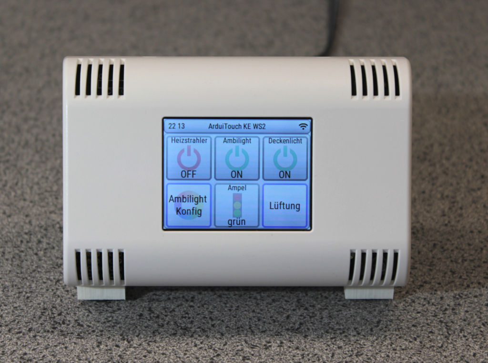
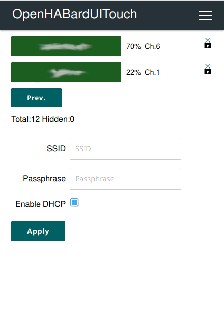
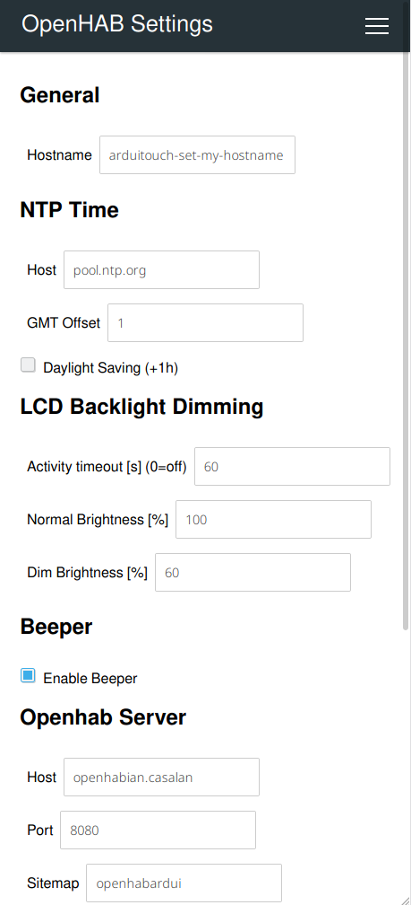

# OhEzTouch

## Introduction



OhEzTouch is a simple always-on touch control device for home automation systems driven by [OpenHAB](https://www.openhab.org/).

The touch buttons and graphics are dynamically generated. The structure is defined by an individual OpenHAB sitemap on the server side.

## Partlist

- [ESP32 NodeMCU](https://www.az-delivery.de/products/esp32-developmentboard) or [ESP32 Dev Kit C V4](https://www.az-delivery.de/products/esp-32-dev-kit-c-v4)
- [ArduiTouch](https://www.az-delivery.de/products/az-touch-wandgehauseset-mit-touchscreen-fur-esp8266-und-esp32)

## Installation

This projekt uses PlatformIO to build and upload the firmware.

For now, only Linux instructions are available.

### Prerequisites
In order to build and upload this project, PlatformIO is required.

#### Debian/Ubuntu based distributions
```bash
sudo apt install python3-pip
sudo pip install -U platformio
```

### Get code
```
git clone https://github.com/c5n/oh-ez-touch.git
```

### Configuration
It is possible to configure WLAN SSID and password before compilation, so the ESP32 connects right to your WLAN. Of course, other things can be changed as well. Configuration file: ```data/config.json```

If you don't change the settings or the device can not connect to your network, the ESP32 will switch to AccessPoint mode. You can connect to it using a MobilePhone. See chapter [Usage](#usage) for more details.

### Build
```
cd oh-ez-touch
pio run
```

### Upload
Connect the ESP32 board to your computer. A ttyUSB device should appear. It will likely be /dev/ttyUSB0 if no other USB-serial adapters are connected.

2 files have to be uploaded: The filesystem image and the firmware.

If you have no user rights to access the /dev/ttyUSB device, one option is to add a ```sudo```. Another would be to [add udev rules](https://docs.platformio.org/en/latest/faq.html#platformio-udev-rules) to allow user access.

Execute the following command to upload firmware.
Upon the output of ```Connecting........_____``` press and hold BOOT button on ESP32 until the upload process starts.

Upload the filesystem image.

```
pio run -t uploadfs --upload-port /dev/ttyUSB0
```

#### ArduiTouch
For the old version with through hole parts for self soldering:
```
pio run -t upload -e ArduiTouch --upload-port /dev/ttyUSB0
```

#### ArduiTouch MOD
For the new version with SMD parts:
```
pio run -t upload -e ArduiTouchMOD --upload-port /dev/ttyUSB0
```

### Update tool
To update one or more devices over the air, a simple script is provided in the tools folder.

```
Usage:
    ./tools/batchupdate.sh [-p] -t <target> <hostname1> <hostname2> ...
    ./tools/batchupdate.sh [-p] -l <listfile>

    -p              Parallel multi process update

    -t <target>     Target should be one of the available build targets.
                    e.g. ArduiTouchMOD

    -l <listfile>   Text file with list of target and hostnames.
                    Each line has target hostname, separated by tabs or spaces.
```

If you have more than one ArduiTouch device, it makes sense to create a ```listfile``` with all of your devices.

Example ```myOhEzTouchDevices.txt```:
```
Arduitouch      oheztouch-01
ArduitouchMOD   oheztouch-02
Arduitouch      oheztouch-03
```

It is possible to update all devices in parallel by using the ```-p``` option.

#### Update project folder
```
git pull
```
#### Rebuild targets
```
pio run
```
#### Roll out update
Example for update of all of your devices by using the listfile:
```
./tools/batchupdate.sh -p -l myOhEzTouchDevices.txt
```

## Usage

### OpenHAB Sitemap

Sitemaps for the OhEzTouch can contain the following elements:
- Colorpicker
- Selection
- Setpoint
- Slider
- Switch
- Text

Example Sitemap from my own installation:
```
sitemap openhabardui_ke_ws2 label="ArduiTouch KE WS2"
{
    Switch item=UG_WS2_Heizung_PC
    Switch item=UG_WS2_Licht_Spezial
    Switch item=UG_WS2_Licht_Decke

    Text label="Ambilight Konfig" icon="colorlight"
    {
        Switch item=UG_WS2_Licht_Spezial
        Selection icon="colorlight" item=UG_WS2_Licht_Spezial_Mode mappings=["AUS"="Off", "ÜBERBLENDEN"="Blend", "ROTER_ALARM"="RED ALERT", "FARBWAHL_1"="Preset 1", "FARBWAHL_2"="Preset 2", "FARBWAHL_3"="Preset 3"]
        Colorpicker item=UG_WS2_Licht_Spezial_PC_ColorHSB label="Farbe"
        Slider item=UG_WS2_Licht_Spezial_PC_Speed label="Geschwindigkeit" minValue=1.5 maxValue=20 step=2
    }

    Selection item=UG_WG2_Ampel_Zustand label="Ampel" mappings=["ROT"="rot", "GELB"="gelb", "GRUEN"="grün", "AUS"="aus"] icon="trafficlight"

    Text label="Lüftung" icon="fan"
    {
        Selection item=UG_Belueftung_AutoMode mappings=["AUS"="Aus", "AUTO"="Automatik"]  icon="fan"
        Selection item=UG_Belueftung_ManuMode mappings=["AUS"="Aus", "LUEFTEN"="Lüften", "ENTFEUCHTEN"="Entfeuchten"]  icon="fan"
        Text label="Einstellungen" icon="settings"
        {
            Setpoint item=UG_Belueftung_ManuLueftenDauer minValue=5 maxValue=180 step=5
            Setpoint item=UG_Belueftung_ManuEntfeuchtenDauer minValue=1 maxValue=8 step=1
            Setpoint item=UG_Belueftung_FanOnTime minValue=60 maxValue=3600 step=60
            Setpoint item=UG_Belueftung_FanOffTime minValue=60 maxValue=3600 step=60
            Setpoint item=UG_Belueftung_MaxLuftfeuchte minValue=55 maxValue=70 step=1
        }
        Text item=KE_Sensor_Luftfeuchtigkeit
        Text item=KE_Sensor_AbsLuftfeuchtigkeit
    }
}
```

The example sitemap will look like the UI of the picture in the [Introduction](#introduction).


### Power up
Connect the ArduiTouch to an appropriate power suppy (e.g. 12 V, 300 mA).

### Configuration
If you have configured your WLAN and other things in the data/config.json file, the ArdioTouch should connect and try to load the sitemap right away. Great, you can skip the following steps.

#### Configure new AP
On pristine devices, no WLAN is configured. The ArduiTouch will start an AccessPoint called oheztouch-new after about 30 seconds.

Connect your smartphone to this unsecured WLAN. A notification should appear: "Sign in to a Wi-Fi network". This is the portal page of the ArduiTouch. Click on that.

In the upper right is the menu. Select "Configure new AP".



Fill in your WLAN credentials and click Apply. The ArduiTouch will try to connect. If everything went well, the IP received from your DHCP server will be shown on the display.

#### OpenHAB Settings


##### General

Setting         | Default       | Description
--------------- | --------------| -----------
Hostname        | oheztouch-new | Set the hostname of this device according to your naming convention


##### NTP Time

Setting         | Default       | Description
--------------- | ------------- | -------------
Host            | pool.ntp.org  | Host which serves the time. e.g. pool.ntp.org or your router.
GMT Offset      | 1             | Offset of your timezone from Greenwich Mean Time
Daylight Saving | 0             | Daylight saving +1 hour

##### LCD Backlight Dimming

Setting           | Default     | Description
----------------- | ----------- | -------------
Activity timeout  | 60          | After the timeout defined in seconds since last touch the display will dim down
Normal Brightness | 100         | Normal brightness level in percent
Dim Brightness    | 40          | Dim brightness level in percent

##### Beeper

Setting         | Default       | Description
--------------- | ------------- | -------------
Enable Beeper   | On            | Enable blips and bleeps

##### Openhab Server

Setting         | Default       | Description
--------------- | ------------- | -------------
Host            | openhabian    | Hostname of the OpenHAB server
Port            | 8080          | Port
Sitemap         | oheztouch     | Name of the sitemap you've setup for this ArduiTouch device

### Fix icons

Some of the original openhab-webui icons are exceptionally large for no reason. Since the ESP32 has limited RAM resources, we have to take file sizes into account. Re-encoding of the PNG graphic files using '''convert''' is the solution for now.

```
sudo apt install imagemagick
git clone https://github.com/openhab/openhab-webui.git
cd openhab-webui/bundles/org.openhab.ui.iconset.classic/src/main/resources/icons
mkdir output
for f in *.png; do convert $f -strip output/$f; done
```

Move the files from ```output``` folder to your ```openhab2-conf/icons/classic/``` folder.

I know, this is not very convenient. Finding a solution has top priority on my todo list.

## Development

The project is still under development, but is already very usable.

If you have any comments, suggestions or even code to submit, please let me know. I'm happy to hear from you. :)

Contact: c5n AT posteo DOT de

## ToDo list

- [ ] openhab_ui: Fix icon loading. Some of the original icon file sizes are too large and have to be reencoded.
- [ ] openhab_ui: Auto close item manipulation window after timeout
- [ ] openhab_ui: Auto back to homescreen after timeout
- [ ] openhab_ui: Prefer widget label text instead of item label text
- [ ] openhab_ui: Add secured sections with PIN protection
- [x] openhab_ui: Improve selection, setpoint and slider elements
- [x] ac: Improve OTA firmware update --> batchupdate.sh
- [ ] main: Show portal active icon
- [ ] openhab_ui: Add theme support
- [ ] main: Add screen calibration
- [ ] main: Add setup wizard with WLAN credential input instead of portal procedure
- [ ] sensors: Sensors should submit update instead of command
- [ ] sensors: Support DS18B20 onewire sensors

## License
[GNU General Public License v3.0](LICENSE.md)

## Greetings to 3rd party projects and libraries
This project was created using the following projects and libraries. A big thank you to all of them and the ones I missed:

- https://platformio.org/
- https://lvgl.io/
- https://arduinojson.org/
- https://github.com/Hieromon/AutoConnect
- https://github.com/Bodmer/TFT_eSPI
- https://github.com/YiannisBourkelis/Uptime-Library
