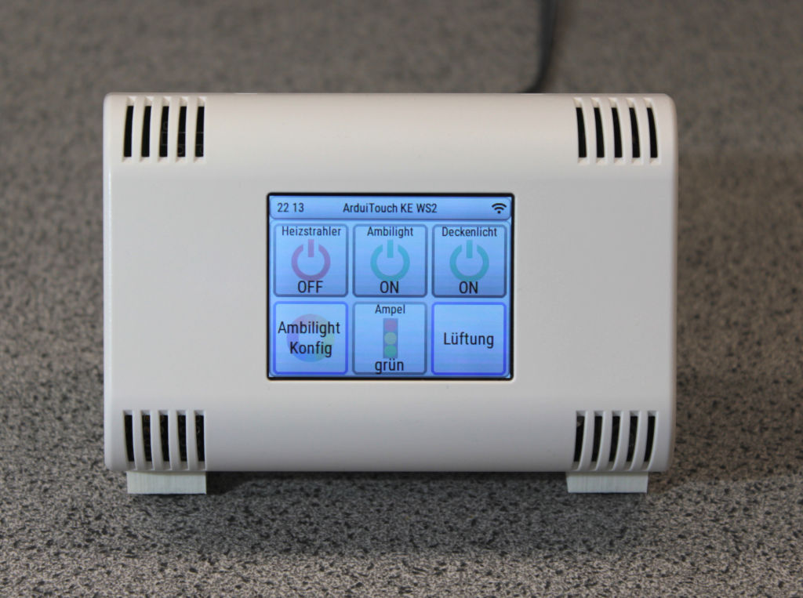

# OhEzTouch

## Introduction



OhEzTouch is a simple always-on touch control device for home automation systems driven by [OpenHAB](https://www.openhab.org/).

The touch buttons and graphics are dynamically generated. The structure is defined by an individual OpenHAB sitemap on the server side.

## Partlist

- [ESP32 NodeMCU](https://www.az-delivery.de/products/esp32-developmentboard) or [ESP32 Dev Kit C V4](https://www.az-delivery.de/products/esp-32-dev-kit-c-v4), /for both, no SDCard is needed)
- [ArduiTouch](https://www.az-delivery.de/products/az-touch-wandgehauseset-mit-touchscreen-fur-esp8266-und-esp32)

(optional)
## Option A
- [DC Socket e.g.](https://www.amazon.de/dp/B0975TSZRV?psc=1&ref=ppx_yo2ov_dt_b_product_details)
- For Flashing: USB zu TTL Serial Adapter, best experience with: [FT232-AZ USB zu TTL Serial Adapter für 3,3V und 5V](https://www.az-delivery.de/products/ftdi-adapter-ft232rl)
## Option B
- Switch (https://www.amazon.de/dp/B0966WQRH6?psc=1&ref=ppx_yo2ov_dt_b_product_details)
- DC/AC Transformator (https://www.az-delivery.de/products/copy-of-220v-zu-5v-mini-netzteil)

## Installation

This project is built with [ESP-IDF](https://docs.espressif.com/projects/esp-idf/en/v6.1/esp32/),
which is also what builds the desktop simulator.

For now, only Linux instructions are available.

### Prerequisites

ESP-IDF **v6.1**. The version is pinned rather than "recent enough": the
`linux` target the simulator uses is officially a preview feature, so an IDF
upgrade is a change to verify rather than a routine update.

```bash
mkdir -p ~/esp
git -C ~/esp clone -b v6.1 --depth 1 --recursive https://github.com/espressif/esp-idf.git
~/esp/esp-idf/install.sh esp32
```

`. ~/esp/esp-idf/export.sh` puts `idf.py` on the PATH, and has to be run once
per shell.

#### Debian/Ubuntu based distributions

```bash
sudo apt install libsdl2-dev libbsd-dev pkg-config ninja-build
```

`libsdl2-dev` is the simulator's window. `libbsd-dev` is not optional and its
absence is not obvious: IDF's own `components/linux/linux_include/string.h`
includes `<bsd/string.h>` unconditionally, so without it every translation
unit of the simulator fails to compile -- and IDF's CMake only warns about it.

### Get code

The two libraries this project vendors are submodules, so clone recursively:

```bash
git clone --recurse-submodules https://github.com/c5n/oh-ez-touch.git
```

In an existing working copy, `git submodule update --init --recursive`.

### Configuration

Defaults for the hostname, NTP, appearance, backlight, beeper and the OpenHAB
server can be set before compilation in ```data/config.json```. They are the
values a pristine device starts with; everything there can also be changed
later in the web interface. `idf.py flash` writes that file to the device's
filesystem along with the firmware -- there is no separate upload step any
more.

The built-in defaults apply to anything the file does not mention, so a partial
`config.json` is fine and a missing one leaves a complete, working
configuration. They live in `main/config/config_fields.cpp`, one per row of the
settings table, next to the range that setting accepts and the place it is
stored under -- so a value the file gives outside that range is clamped to it,
and a host name containing `/` or `:` is refused and the default kept.

WLAN credentials are not part of that file. They are kept in the ESP32's NVS,
which survives both an OTA update and a filesystem reflash -- a config file
would be overwritten by the latter. Credentials stored by older firmware, which
used AutoConnect, are migrated automatically on the first boot of this one.

A device with no credentials raises an open access point named after its
hostname and shows that name and its address on screen. You can connect to it
with a phone. See chapter [Usage](#usage) for more details.

### Build

Each board is a build of its own, selected by a defaults file. The build
directory is what identifies it afterwards, including to the update tool.

```bash
cd oh-ez-touch
. ~/esp/esp-idf/export.sh

idf.py -B build/arduitouch -DSDKCONFIG=build/arduitouch/sdkconfig \
       -DSDKCONFIG_DEFAULTS="sdkconfig.defaults;sdkconfig.defaults.esp32;sdkconfig.defaults.arduitouch" \
       set-target esp32
idf.py -B build/arduitouch build
```

The three boards are `sdkconfig.defaults.arduitouch` (2.4"),
`sdkconfig.defaults.arduitouch28` (2.8") and `sdkconfig.defaults.lanbon`
(Lanbon L8). Omitting the board file gives the ArduiTouch 2.4", which is the
Kconfig default. `sdkconfig.defaults.arduitouch_jtag` is the 2.4" with the two
pins an attached esp-prog needs moved out of its way.

`-DSDKCONFIG` is not optional when more than one target is in play: `idf.py`
otherwise writes the generated `sdkconfig` to the project root, where the
builds overwrite each other's and the second one refuses to start. Keeping it
inside the build directory means `-B` alone identifies a build.

Note that a defaults file only seeds a **new** `sdkconfig`. After editing one,
delete that build's `sdkconfig` -- or the whole build directory -- and re-run
`set-target`.

`idf.py -B build/arduitouch menuconfig` reaches everything else, including the
board choice, the beeper engine, the JTAG pin remap and the per-module debug
output under **OhEzTouch**.

Building all of them at once, clean and collected for a rollout, is what
```tools/build_release.py``` does; see *Update tool* below.

### Simulator

The user interface can also be built and run on the development machine, in an
SDL2 window, without any hardware. This is handy for working on the layout and
the styling -- and, since it is the same code, for working on the openHAB
client and the web interface too.

```bash
idf.py -B build/linux -DSDKCONFIG=build/linux/sdkconfig \
       -DSDKCONFIG_DEFAULTS="sdkconfig.defaults;sdkconfig.defaults.linux" \
       --preview set-target linux
idf.py -B build/linux build
./build/linux/oh-ez-touch.elf
```

An "OhEzTouch" window opens showing a 320x240 screen at double size
(`port_display_init()` in `main/port/linux/port_display.c`). Mouse clicks act as
touch input; closing the window ends the program.

The simulator is not a separate build of a reduced program. It is the same
sources, the same LVGL version, the same `lv_conf.h`, fonts and styles; what
differs is confined to `main/port/`, which has one implementation per target.
So the panel really does fetch its sitemap over HTTP, really does serve its
web interface, and really does store its settings.

- **openHAB**: set the server with the config file, or with
  `OHEZ_OPENHAB_HOST`, `OHEZ_OPENHAB_PORT` and `OHEZ_SITEMAP`. Operating a
  widget POSTs a command, exactly as the panel does.
- **Web interface**: on port 8780 rather than 80, since an unprivileged process
  cannot bind 80. `OHEZ_WEBUI_PORT` overrides that.
- **Settings**: stored in `$XDG_CONFIG_HOME/oh-ez-touch/config.json` (or
  `~/.config/oh-ez-touch/config.json`), which is a real file that can be edited
  by hand. `OHEZ_CONFIG_DIR` moves it.
- **WLAN credentials**: stored in an emulated NVS image under
  `$XDG_STATE_HOME/oh-ez-touch/flash.bin`. `OHEZ_STATE_DIR` moves it. Two
  simulator instances cannot share one, and the second to start says so rather
  than corrupting it.
- **No radio, no backlight, no sensor and no OTA.** These report "there is
  none" rather than pretending: the WLAN tab's **Scan** answers from a canned
  list, the sensor publishes nothing, and `POST /update` answers 501.
- **The buzzer, though, works.** A desktop has no piezo, so the simulator
  synthesises what the panel's PWM channel would be doing and plays it through
  SDL -- see [Hearing the panel](#hearing-the-panel).

#### Offline mode

`OHEZ_OFFLINE=1` serves the sitemap and the widget icons from compiled-in
fixtures instead of the network. That gives a stable, reproducible screen for
comparing rendering changes, and lets the UI be worked on with no openHAB
anywhere:

```bash
OHEZ_OFFLINE=1 ./build/linux/oh-ez-touch.elf
```

The fixture in `main/sim/sitemap_fixture.cpp` is a small demo sitemap -- a home
page with two sub pages -- covering every widget type the UI supports, and it
goes through the very same parser as a real server response. Edit that file to
reproduce a particular sitemap. Item states are read from it and not written
back, so operating a widget changes it locally only.

The widget icons are not part of this repository -- the openHAB classic icon set
is licensed under the EPL-2.0, which is incompatible with this project's
GPL-3.0 -- so fetch them once into your working copy:

```bash
tools/fetch_sim_icons.py
```

This downloads the icons the demo sitemap uses, rasterizes them and writes
`main/sim/icon_fixture_data.h`, which is ignored by git. It needs network access
and one of `inkscape`, `rsvg-convert` or ImageMagick. Until it has been run,
offline mode draws the widgets without icons, just as the firmware does when an
icon request fails.

To look at the icon set itself rather than at the fixture -- to see what a name
resolves to before putting it in a sitemap, or to fill an `/icon/` mock --
`tools/fetch_openhab_icons.py` fetches the whole classic set as PNG files:

```bash
tools/fetch_openhab_icons.py                    # all of it, 32x32, into openhab-icons/
tools/fetch_openhab_icons.py --size 64          # bigger
tools/fetch_openhab_icons.py light heating      # named icons and their state variants
```

State variants land next to their default (`light.png`, `light-on.png`,
`light-off.png`), the way openHAB serves them. Its output directory is ignored
by git for the same licensing reason.

#### Environment overrides

The `OHEZ_*` variables are applied after the config file, so it can be inspected
without being edited. They work on the device too, which simply has no
environment to read them from.

```bash
OHEZ_THEME=lcars ./build/linux/oh-ez-touch.elf
OHEZ_THEME=jarvis OHEZ_NIGHT=on ./build/linux/oh-ez-touch.elf
```

`OHEZ_THEME` takes `material` (warm paper, flat cards, one teal accent),
`lcars` (the spine-and-elbow frame, blocks coloured by item type), `jarvis`
(Reticle -- corner brackets, hairlines and ring gauges) or `classic` (the
blue-on-silver look the UI was born with), and
`OHEZ_NIGHT` takes `off`, `on` or `auto`; anything unrecognised means the
default. `OHEZ_NIGHT_FROM` and
`OHEZ_NIGHT_TO` set the hours the `auto` window spans (22 and 6 by default).

The clock follows the *configured* GMT offset rather than the host's timezone,
because that is what the panel would show -- including an offset the user got
wrong. `OHEZ_NIGHT=auto` can be watched crossing its boundary.

`OHEZ_MQTT`, `OHEZ_MQTT_HOST`, `OHEZ_MQTT_PORT` and `OHEZ_MQTT_TOPIC` point the
MQTT client at a broker for one run, which is the quickest way to watch what it
publishes:

```bash
OHEZ_MQTT=on OHEZ_MQTT_HOST=localhost ./build/linux/oh-ez-touch.elf
```

`OHEZ_MQTT` takes `on` or `off`; anything that is not `off` or `0` enables it.

#### Hearing the panel

The simulator makes sound -- see [The beeper](doc/beeper.md) for what it is
making. `main/port/linux/port_beeper.c` opens an SDL audio
device and synthesises the pulse train the panel's LEDC channel would be
producing, so clicking around the simulator is how the chime tables get
listened to -- there is no separate renderer and no second copy of the
synthesis to drift out of step.

It does not follow the driver's `port_beeper_tone()` calls. It takes the whole
chime and walks the selected engine's frame function itself at the sample rate,
because this target's FreeRTOS tick is 4 ms and a two-millisecond interleave slot
cannot be honoured from a task here. Following the calls would render every chord
four times coarser than the panel plays it, which is the one direction a
simulator must not be wrong in: it would sound worse than the hardware and
somebody would go and "fix" a table that was fine.

It is wrong in that direction in one place unless it is careful, and it is
careful: the engine's *parameters* -- the swept pitch, the envelope, the two
LFOs -- are re-evaluated on the engine's own five-millisecond grid and not per
sample. Only the oscillator runs faster. A simulator with a smoother vibrato
than the hardware would flatter the panel, and a table tuned against it would
arrive on real glass sounding stepped.

The oscillator is sampled eight times per output sample and averaged, which is
the same thing as asking what fraction of each sample period the pulse was
actually high. Without that it was one comparison per sample, and a pulse has
harmonics without end: everything above half the sample rate folded back to a
frequency unrelated to the note, putting a 588 Hz tone under a note at 3951 Hz
at a fifth of its amplitude, and making slow sweeps grow whistles that ran
downward while the note rose. It was worse at low volume, because the shipped
master of 25 makes the duty 12.5 % and a narrow pulse is spectrally richer than
a square. **The panel does none of that** -- LEDC drives the pin with a real
square wave, nothing is sampled, so nothing folds and the harmonics stay above
the piezo's resonance where it cannot radiate them. That was the simulator
inventing a defect the hardware has not got, which is the same mistake as the
paragraph above and is why the fix is in the renderer rather than in a table.

```bash
OHEZ_THEME=material ./build/linux/oh-ez-touch.elf
OHEZ_THEME=lcars    ./build/linux/oh-ez-touch.elf
OHEZ_THEME=jarvis   ./build/linux/oh-ez-touch.elf
```

The beeper has to be enabled in the settings, as on the panel. `SDL_AUDIODRIVER=disk`
with `SDL_DISKAUDIOFILE` writes the raw stream to a file instead of playing it,
which is how a chime gets measured rather than judged.

**What it will tell you**: rhythm, contour, intervals, whether two chimes are
confusable, whether one outstays the gesture it answers, whether the voices of
a chord clash, how audible the interleaving grain is, and -- on the default
engine -- whether an envelope or a vibrato does what its preset row claims.

**What it will not tell you is how loud anything is.** The ArduiTouch's
transducer has a sharp mechanical resonance somewhere around 2-4 kHz, so on a
panel a note at the peak can be ten or twenty decibels above one an octave
away, and the deliberately low alert sounds will be far quieter in a room than
they are here. Nothing models that, nor the ringing after the drive stops, nor
the case it is glued into, nor LEDC's frequency quantisation, nor the jitter of
a slot loop running next to LVGL. The simulator is cleaner than the hardware,
unavoidably. Judge structure here; judge loudness on a panel.

`OHEZ_BLE_FIXTURE=1` serves four compiled-in BLE advertisements -- an iBeacon,
an Eddystone-UID, an Eddystone-TLM frame from the same advertiser, and a plain
named device -- instead of the Bluetooth the host does not have. They go through
the very same parsers a real advertisement does, so the beacon table, the
averaging, the expiry and the topics can all be watched on a desktop:

```bash
OHEZ_BLE_FIXTURE=1 ./build/linux/oh-ez-touch.elf
```

Off by default, for the reason the BME280 invents nothing on the host: these
readings are published to a broker, and a simulator that quietly wrote fiction
into someone's presence history would be worse than one that did nothing.

`OHEZ_SETTINGS` opens the settings screen at boot, on the page it names --
a section (`theme`, `audio`, `info`, `wlan`, `openhab`, `mqtt`, `sensors`,
`device`, `time`) or a menu (`settings`, also spelled `index`, and `system`):

```bash
OHEZ_SETTINGS=wlan ./build/linux/oh-ez-touch.elf
```

`OHEZ_ITEM` walks to one control and opens it. The value is a dot-separated
path of tile indices: every step but the last follows that tile's linked page,
and the last opens that tile's control. So `5` opens the sixth tile of the
home page, and `0.4` follows the first tile and then opens the fifth tile of
the page behind it.

```bash
OHEZ_ITEM=0.4 OHEZ_THEME=lcars OHEZ_NIGHT=on ./build/linux/oh-ez-touch.elf
```

The item screens are three taps deep on a sub page, which makes "show me the
setpoint screen in LCARS night" tedious by hand and impossible from a script.

Touching the status bar opens it here too, but on the host there is no radio to
leave unconfigured, so the screen never comes up on its own the way it does on a
pristine device.

#### Driving it from a script

Everything above arranges a state at boot and then leaves you watching a
window. The simulator also listens on **127.0.0.1:8781** for commands: send a
tap or a drag, ask what is on screen, read the telemetry, pull the
framebuffer.

```bash
OHEZ_OFFLINE=1 ./build/linux/oh-ez-touch.elf &
tools/ohez_ctl.py wait-page
tools/ohez_ctl.py tap-label "Hallway Dimmer"
tools/ohez_ctl.py shot /tmp/panel.png --scale 2
```

`tools/ohez_ctl.py` is the client and needs nothing but Python 3. The screen
comes back as JSON -- which screen is up, each tile's label, state, type and
rectangle -- so a check can assert on a value rather than on pixels, and a tile
can be tapped by its label rather than by coordinates a layout change is free
to move.

Screenshots travel as raw pixels and become a PNG on this machine: the panel
never encodes one, because the hardware has no RAM to spare for an encoder, and
that is what keeps the same wire format usable on a device later.

`OHEZ_TESTIF=0` turns the socket off and `OHEZ_TESTIF_PORT` moves it. None of
this is compiled into a panel's firmware.

**[doc/test-interface.md](doc/test-interface.md) is the full reference**: the
command table, the JSON, the framebuffer header, and the handful of gotchas
that otherwise cost an hour.

### Testing against a real openHAB

The compiled-in fixtures draw a screen without a server, which is what makes the
simulator worth having -- but they cannot say what openHAB really sends, and
several of the things they were written to assume turned out to be wrong.
`test/openhab/` holds sitemaps and items to point a real server at: one page
with six widget types on it, one with the shapes that page has no example of,
and a five-level navigation tree that reaches every fixed limit the panel has.
`test/openhab/seed-states.sh` gives them all a value worth looking at.

**[doc/openhab-fixtures.md](doc/openhab-fixtures.md)** installs them, says what
each one is for, writes down what a real openHAB actually puts on the wire, and
lists the places where the panel and the server still disagree.

### Fonts

The LVGL font sources in `components/lvgl/fonts/` are generated and committed,
so a normal build needs no font tooling. Regenerate them with
`tools/build_fonts.sh` after changing a face, a size or a glyph range; it needs
`lv_font_conv` (an npm tool) and network access to fetch the faces from Google
Fonts.

There are three, one per theme family:

| family | face | licence |
| --- | --- | --- |
| `ui` | Barlow -- Material | OFL 1.1 |
| `hud` | Rajdhani -- Reticle | OFL 1.1 |
| `lcars` | Antonio -- LCARS | OFL 1.1 |

Each of the three sizes is generated from a **different static weight** of its
face -- Regular at 16, Medium at 22, SemiBold at 36 -- so a caption, a label
and a reading differ in weight as well as in size. That is where the type
hierarchy comes from and it costs nothing: three files either way.

It is also why Barlow and Rajdhani rather than the more obvious modern choices.
Inter, Manrope, Figtree, Outfit, Public Sans, Work Sans, DM Sans, IBM Plex
Sans, Archivo, Saira and Space Grotesk are all variable-only in `google/fonts`,
and `lv_font_conv` renders a variable font's default instance -- Regular --
with no way to ask for another short of instancing it with `fonttools` first.
Antonio is variable too, and stays that way: LCARS wants one weight anyway.

The nine faces are about 210 KB of flash, which is the largest single item in
the firmware after LVGL itself.

### Tests

The unit tests are an ESP-IDF project of their own, on the same `linux` target
as the simulator:

```bash
cd test/host
idf.py --preview set-target linux
idf.py build && ./build/oh-ez-touch-host-test.elf
```

It exits with the number of failures, so it can be used in a script as it
reads.

`test_item_setters` covers the string setters of `Item`, which copy labels,
states, patterns and mappings of unknown length straight out of the sitemap
JSON that openHAB serves. Those copies have to truncate cleanly, and the tests
place a canary after the object to catch one that does not.

`test_ui_theme` covers the theme name lookups in `main/ui/ui_theme.hpp`. They are
the only funnel between a theme's name and its enum, and four callers pass
through them -- the config file, the web form, the environment overrides and the
compiled-in defaults -- none of which checks the result, so the fallback has to
hold for a typo, an empty string and a NULL alike. It also holds for `Default`,
the name this family had before it was renamed to Material: a `config.json`
written by an older firmware names a theme that is no longer in the table, and
what keeps that panel on the look it was already showing is the fallback and
nothing else.

`test_config_fields` covers the settings table in `main/config/config_fields.cpp`
-- the one description of every setting, walked by the web form, the panel's
settings screen, the MQTT client and the config file alike. What it pins down is
the table rather than the accessors: that no two rows share a name, that a name
is usable both as a POST argument and as an MQTT topic segment, that every tab
has rows on it, that the rows flagged as needing a restart are the ones that
really do, that no two rows claim the same place in the file, and that every
default is inside the range its own row declares.

`test_config_file` covers `config.json` itself: the shipped defaults, a value
per section surviving a save and a load, a corrupt file, a file that omits
whole sections, and the validation above. Since `Config::loadConfig()` and
`Config::saveConfig()` stopped naming settings and started reading the path and
the default off each row, the file format is *data* -- and data with no test is
a format that changes by accident, with the only symptom on a real panel being
one value quietly reverting after a reboot. It makes its own directory under
`$TMPDIR`, so running the suite cannot touch the config of a simulator you are
using.

`test_multipart` covers the firmware upload's body scanner in
`main/web/multipart.c`. It earns its keep for the same reason `test_ble_beacon`
does and then some: it is the one path in this firmware that can leave a panel
unbootable, and the only one that parses bytes somebody else chose with no
authentication in front of it -- `/update` is open, and so is the setup access
point that reaches it. The scanner was welded to `esp_ota_begin()` and
`esp_ota_write()` and so was device-only and untestable; it writes into a sink
now. The suite found a buffer overrun on the first run: the multipart boundary
is the first line of the body, the sender picks it, and nothing checked its
length.

`test_ble_beacon` covers the advertisement parsers in
`main/ble/ble_beacon.cpp`, and is the suite that earns its keep most easily. The
iBeacon and Eddystone layouts are specified by Apple and by Google and cannot be
checked by reading the code that consumes them; the bytes arrive off the air
from devices nobody here wrote, so malformed input is the normal case rather than
the exception; and there is nowhere else to exercise any of it, because a desktop
has no Bluetooth and the device firmware has never been run on hardware. So the
suite walks a valid advertisement truncated at every possible length, feeds it
lengths that run past the end of the payload, and pins down each format's
identity, reference power and telemetry byte by byte. It found two bugs in its
own fixtures and one in the URL character ranges on the first run.

`test_testif_parse` covers the request tokeniser in
`main/testif/testif_parse.c`, which is the one part of the simulator's control
interface that this binary can reach -- the rest of it is a socket, an LVGL
input device and a dump of the screen. It qualifies on the same terms the
multipart scanner does: it reads a datagram somebody outside the process
composed, and it decides where each argument of a command that presses buttons
begins and ends. The cases that matter are the ones a hand-typed `nc -u` line
produces and the client never does -- a trailing newline, a doubled space, an
unclosed quote, a lone `@` -- and the two limits, since a datagram is free to
carry more tokens than the argument vector holds.

`test_beeper_mixer` covers the arithmetic in `main/control/beeper_mixer.c`:
the envelope curves and their edges, a sweep in both directions -- a falling
one wraps into the ultrasound without the signed cast, and one of the LCARS
chimes falls -- when a voice is alive but silent, how a frame divides itself
between the voices sounding at that instant, and that a voice which has
finished stops taking a slot from the ones that have not. Two of them are
load-bearing beyond their own subject. One asserts that a frame is a pure
function of its arguments, because the simulator's audio callback evaluates
frames at times of its own choosing and a round-robin cursor hidden in a file
static would make that quietly wrong rather than loudly broken. The other
asserts that the shipped defaults come out at 63 counts of duty, which is what
every beep this firmware has ever made was, and is the promise that giving the
panel a volume setting did not change how loud it is for anyone who never
touches it.

`test_beeper_seq` covers the default engine's arithmetic, which has more ways to
be wrong because it multiplies: the same falling sweep, plus a glide that must
stay monotone, an LFO that must not overflow its own multiply, a tremolo that
must never push a note past the peak its envelope asked for, and a zero-length
note that must be stepped over rather than divided by. It re-asserts both of the
load-bearing ones above, the purity and the 63 counts of duty, because both are
promises about the panel rather than about one way of arranging its notes.

`test_ui_beep_chimes` and `test_ui_beep_tunes` cover the tables, one suite per
engine. There are three families and eighteen sounds, which is fifty-four
written out by hand *for each*, and every target that can run a test is silent
-- so the first thing each checks is the boring one, that none of them is
missing. The rest are the constraints nobody has in mind while writing
frequencies: that they stay in the band a small piezo is loud in, with a named
exemption for the alert sounds and a second test making sure the exemption is
still being used; and that no sound outstays the gesture it answers.

Each then has one rule the other cannot have. For the mixer it is that nothing
below a kilohertz is ever stacked, which is a property of the interleaving. For
the sequencer it is that no note carries an LFO slower than itself -- an
ornament that does not complete a cycle is a pitch bend, and that is invisible
in a table where the note looks like it has a vibrato and the effect row looks
like a vibrato. It caught three of the six shipped effect rows.

Both suites run in the same binary even though a panel ships one engine, because
the set that is not selected is exactly the one nobody would notice going stale.
That is why the two table files export different type and symbol names: they
have to link side by side.

What every file linked out of `main/` here has in common is that it touches
neither LVGL nor the network: the settings table and the config file over it,
the beacon parsers, the sitemap model and both its parsers -- a page, and the
list of sitemaps a server offers -- the mDNS query that finds those servers in
the first place, the relay and LED payload
rules, the multipart scanner, the control interface's tokeniser, and both engines'
sound tables with both engines' arithmetic under them. For the beacon parsers that is not a happy
accident but the reason `main/port/port_ble.h` yields raw advertisement bytes
and leaves the parsing above the port layer, and the same argument moved the
multipart scanner out of `webui_ota.cpp`. The remaining suites cover
header-only code and link nothing, which is what keeps the test app worth
having.

### Upload

Example for Connecting UART TTL Adapters for flashing works for me:
- Put UART TTL Adapter on 5V with jumper
- UART VCC connection to ESP32 5V
- UART GND connection to ESP32 GND (6. PIN same Row 5V)
- UART RX connection to ESP32 TXD
- UART TX connection to ESP32 RXD
- Connect ESP GND to ESP G0 for Flashing Mode

Connect the ESP32 board to your computer. A ttyUSB device should appear. It will likely be /dev/ttyUSB0 if no other USB-serial adapters are connected.
Use following Command after connecting to identify just connected adapters
```
dmesg | grep /dev/ttyUSB
```

If you have no user rights to access the /dev/ttyUSB device, one option is to
add a ```sudo```. Another would be to add
[udev rules](https://docs.espressif.com/projects/esp-idf/en/v6.1/esp32/get-started/establish-serial-connection.html)
to allow user access.

One command uploads everything -- the bootloader, the partition table, the
firmware and the filesystem image built from ```data/```:

```bash
idf.py -B build/arduitouch -p /dev/ttyUSB0 flash monitor
```

Upon the output of ```Connecting........_____``` press and hold the BOOT button
on the ESP32 until the upload process starts.
!! In some circumstances (don't know why) the RST needs to be pushed short time to connect instead of BOOT !!

`monitor` is optional and shows the serial log; `Ctrl-]` leaves it.

### Update tool
To update one or more devices over the air, ```tools/batchupdate.py``` is
provided. It needs nothing but Python 3.

The devices are named in a JSON list file, each with the build target its
hardware needs -- the target cannot be asked for remotely, and the fleet is
usually mixed. The target is the name of a build directory under ```build/```,
which is what identifies a board now that each one is a separate ESP-IDF
build.

Example ```myOhEzTouchDevices.json``` (see ```tools/devices.example.json```):
```json
{
  "devices": [
    { "host": "oheztouch-01", "target": "arduitouch" },
    { "host": "oheztouch-02", "target": "arduitouch28", "comment": "hallway, 2.8 inch" },
    { "host": "192.168.1.50", "target": "lanbon" }
  ]
}
```

The old PlatformIO target names (```ArduiTouch```, ```ArduiTouch28```,
```Lanbon```) from pre-0.90 list files are accepted as aliases.

Writing the list by hand is not the only way to get one:
```tools/discover.py``` scans a subnet for devices -- one ```GET /``` per
address, short timeouts, bounded parallelism, nothing more -- and prints what
it finds as a table. With ```-o``` the same result is also written in the
list file format:

```
./tools/discover.py 192.168.1.0/24                      # just look
./tools/discover.py 192.168.1.0/24 -o myOhEzTouchDevices.json
```

Devices on 0.90 or later answer with their version and target, so their
entries come out complete. Devices on the pre-0.90 firmware are recognised by
their AutoConnect pages, but they can tell neither version nor target over
HTTP, so they come out with ```"target": null``` -- deliberately:
```batchupdate.py``` refuses such a file until a person has filled in which
board each device is, because that choice decides which image it gets flashed
with. The one thing a pre-0.90 device does tell is its configured hostname:
the scanner reads it from the device's openhab_settings page (the single
extra request this takes) into the entry's ```"comment"```. The
```"version"``` a scan records is used too: a device already running the
expected version is skipped, so re-scanning after a partial rollout yields a
list that updates only what is left.

```
Usage:
    ./tools/batchupdate.py myOhEzTouchDevices.json [options]
    ./tools/batchupdate.py -t <target> <hostname1> <hostname2> ...

    -p, --parallel N    update N devices at once (default 1)
    -i, --interactive   ask before every device: yes, skip or abort
    --release X.Y       take images from release/X.Y (default: the latest)
    --timeout S         per-device reboot and verify wait (default 120)
    --retries N         upload attempts per device (default 1)
    --dry-run           validate the list, the images and reachability only
    -o, --retry-file F  where failed devices are written (default retry.json)
```

Per device the script checks the firmware image exists, checks the device
answers HTTP, POSTs the image to ```/update```, and then waits for the device
to come back and reads its status page: the version and the target shown
there have to match, because the pre-0.90 firmware answers HTTP 200 even when
the flash write failed -- the POST succeeding proves nothing. Only a device
back up with the expected firmware counts as a success. While it runs, a
terminal shows one live line per device in flight -- checking, uploading with
a percentage, waiting for the reboot, verifying -- above a progress bar;
piped into a file, each state change is a plain line instead.

Where an image comes from: the latest release build -- ```release/<version>/```
as ```tools/build_release.py``` collects it, ```--release X.Y``` pins an
older one. A target missing from the release falls back to its build
directory under ```build/```, so the development loop needs no release. The
source of every image is printed before anything is flashed, and the version
a device is expected to come back with is the release's.

Failed devices are written to the retry file in the same JSON format, so a
re-run is just ```./tools/batchupdate.py retry.json```. The exit code is the
number of failed devices, so the script chains in scripts of its own.

Updating changes neither the settings nor the WLAN credentials: OTA writes
only the inactive app partition, while ```config.json``` on the SPIFFS
partition and the credentials in NVS are left alone. A device updated from
pre-0.90 firmware keeps its look and its sensor settings as well: a
```config.json``` with no ```ui``` section gets the Classic theme (the one
look that firmware had), the BME280 settings are read from their old place
under ```openhab.sensors```, and AutoConnect's stored WLAN credentials are
migrated on first boot.

#### Update project folder
```
git pull --recurse-submodules
```
#### Rebuild targets
One command builds all hardware targets clean and collects the images,
version-labelled, under `release/<version>/`:
```
./tools/build_release.py
```
The build stays incremental and in place with `--dirty`; `-t` builds a
subset.
#### Roll out update
Check everything is reachable and every image is built, flash nothing:
```
./tools/batchupdate.py --dry-run myOhEzTouchDevices.json
```
Then one device per target type first, then the rest in parallel:
```
./tools/batchupdate.py -t <target> <hostname1> <hostname2> ...
./tools/batchupdate.py -p 4 myOhEzTouchDevices.json
```
Or walked through one by one, each device asking before anything is sent
(yes updates it, skip leaves it for the retry file, abort stops the run):
```
./tools/batchupdate.py -i myOhEzTouchDevices.json
```

## Usage

### OpenHAB Sitemap

Sitemaps for the OhEzTouch can contain the following elements:
- Colorpicker
- Selection
- Setpoint
- Slider
- Switch
- Text
- Default

Example sitemap (```oheztouch.sitemap```):
```
sitemap oheztouch label="OhEzTouch Test"
{
    Switch      item=OHEZTOUCH_Switch
    Selection   item=OHEZTOUCH_Switch mappings=[OFF="Off", ON="On"]
    Selection   item=OHEZTOUCH_Select mappings=["SEL1"="Selection 1", "SEL2"="Selection 2", "SEL3"="Selection 3"]
    Default     item=OHEZTOUCH_Player
    Default     item=OHEZTOUCH_Rollershutter

    Text label="Submenu" icon="settings"
    {
        Setpoint    item=OHEZTOUCH_Number label="Setpoint"  minValue=-10 maxValue=10 step=0.5
        Slider      item=OHEZTOUCH_Number label="Slider"    minValue=-10 maxValue=10 step=1
        Text        item=OHEZTOUCH_Number label="Text"
        Colorpicker item=OHEZTOUCH_Color
    }
}

```
Items for example sitemap:
```
String          OHEZTOUCH_Select        "Selection"         <fan>
String          OHEZTOUCH_String        "String"            <text>
Switch          OHEZTOUCH_Switch        "Switch"            <switch>
Number          OHEZTOUCH_Number        "Number [%.1f °C]"  <temperature>
Color           OHEZTOUCH_Color         "Color [%s]"        <colorlight>
Player          OHEZTOUCH_Player        "Player"            <receiver>
Rollershutter   OHEZTOUCH_Rollershutter "Rollershutter"     <blinds>

```

### Power up
Connect the ArduiTouch to an appropriate power suppy (e.g. 12 V, 300 mA).

### Configuration
Once WLAN credentials have been entered, the ArduiTouch connects and tries to load the sitemap right away, using the defaults from ```data/config.json``` for everything else. On a device that has been through the portal before, you can skip the following steps.

#### Configure the WLAN
On pristine devices, no WLAN is configured. The ArduiTouch immediately raises an open AccessPoint named after its hostname -- ```oheztouch-new``` by default -- and shows that name and the address to open on its own screen.

Connect your smartphone to that unsecured WLAN and open ```http://192.168.4.1/```. There is no captive-portal popup, which is why the device tells you the address itself.

Fill in your network and password in the WLAN section and press Connect. The ArduiTouch reconnects right away; the AccessPoint closes a few seconds later.

If the device is already provisioned but cannot reach its network, it raises the same AccessPoint for ten minutes and then keeps retrying quietly. It is an open network and the firmware update endpoint is unauthenticated, which is why it does not stay up indefinitely.

**The station speaks WPA2, not WPA3.** ```CONFIG_ESP_WIFI_ENABLE_WPA3_SAE``` is off in ```sdkconfig.defaults.esp32``` and that file says what it bought: 37 KB of an app partition with little to spare. A mixed-mode WPA2/WPA3 access point -- which is what a router offering WPA3 almost always is -- accepts this panel as a WPA2 client and nothing changes. An access point configured for WPA3 *only* will not let it associate at all, and the symptom is a panel that raises its own AccessPoint and keeps retrying. Turn the option back on and rebuild if that is the network it has to live on.

#### Web interface
Everything the device serves, on port 80:

Route            | Purpose
---------------- | -------
```/```          | Status, the WLAN section and all settings
```/save```      | Stores the settings and redirects back to ```/```
```/wifi```      | Stores WLAN credentials and reconnects
```/restart```   | Reboots the device
```/update```    | Firmware upload, also used by ```tools/batchupdate.py```

Since 0.91 there is also a REST API, meant for tooling -- the device manager
below is its first client:

Route               | Purpose
------------------- | -------
```GET /api/status```   | Version, target, uptime, network and heap as JSON, without the side effects ```GET /``` has (no sitemap fetch, no mDNS scan), so it is safe to poll
```GET /api/config```   | Every setting with label, kind, value and range or options as JSON; secrets are masked as ```***```
```POST /api/config```  | A JSON object of changed settings. Absent fields are untouched -- unlike ```/save```, where an absent checkbox means "off" -- and one rejected value rolls the whole request back
```GET /api/sounds```   | The sound vocabulary of the theme in force
```POST /api/sound```   | ```{"name":"door_chime","force":true}``` plays a sound; ```force``` plays it past the beeper mute, for locating a panel

None of these is authenticated, and the setup AccessPoint is open, so anyone who can reach the device can reconfigure it or flash it. That has always been true; treat the device as trusted-network-only.

#### Device manager
```devmgr/``` is a web-based fleet manager: a Python script that serves a page
on localhost (nothing but Python 3 needed) and manages the devices over the
REST API above. It scans a subnet for devices, refreshes what it knows about
them on a configurable interval, remembers every device it has ever seen so
one that drops off the network shows as offline rather than vanishing, edits
settings on one device or on a selection at once, updates firmware with a
progress display, and plays a panel's door chime to find it in the field.
What it is doing -- scans, refreshes, saves, updates, every request to a
device -- is visible in the page's debug console.

    python3 devmgr/devmgr.py            # then open http://localhost:8088

Settings and the device list persist in ```devmgr/data/devmgr.json```. The
full description is in [doc/devmgr.md](doc/devmgr.md).

#### Settings on the screen
Touching the upper bar opens the settings screen. It is a menu of large cells
rather than the bar of six symbol-sized tabs it used to be: each cell carries a
pictogram and its name, so nothing has to be recognised from the symbol alone.
Touch one to open that section; the bar across the top of every page is
entirely the way back, and from the first menu it is the **X** that closes the
screen. A section's own buttons -- **Save**, and **Scan** or **Restart** where
they apply -- are in a bar along the bottom.

Page                    | Contents
----------------------- | --------
Theme (eye symbol)      | Theme family, the night variant and its schedule, and the backlight levels and dim timeout
Audio (speaker symbol)  | The beeper: on or off, how loud, and a **Test** button that plays the theme's boot chime at the level being edited
System (gear symbol)    | A menu of the six below, which are set once when the panel goes on the wall and then left alone
&nbsp;&nbsp;WLAN                      | Network and password, plus a **Scan** button that lists the access points in range with their signal strength. Touch one to fill in its name and go straight to the password. **Save** stores the credentials and reconnects.
&nbsp;&nbsp;openHAB (house symbol)    | Two lists and nothing to type: the openHAB servers on the network, and the sitemaps the selected one serves, each with a tick beside the one in use. Touch one to select it. **Scan** asks both questions again, and **Manual** opens a page with the host, port and sitemap as fields, for what the network did not offer
&nbsp;&nbsp;MQTT (upload symbol)      | Broker, port, credentials, and what to publish -- see [MQTT](#mqtt)
&nbsp;&nbsp;Sensors (location symbol) | The BME280 rows, and the BLE beacon scanner
&nbsp;&nbsp;Device (pencil symbol)    | The hostname, which is also the name of the setup access point
&nbsp;&nbsp;Time (sync symbol)        | The NTP host, the GMT offset and daylight saving
Info (list symbol)      | The Systeminfo table -- uptime, version, and the IP your DHCP server handed out -- and a **Restart** button

Touching a row opens an on-screen keyboard for the text and number settings, and
toggles or steps the switches and the drop-down-style ones in place. Nothing is
stored until you press **Save** on that page, so leaving the screen throws away
whatever you were in the middle of typing.

If a setting you changed is one of the two that are only read while the device
boots -- the hostname, and the BME280 on/off -- **Save** offers to restart. Every
other setting applies immediately, on this screen and in the web interface
alike.

**A device with no WLAN credentials brings this screen up by itself at boot**, on
the WLAN tab. That is the whole setup procedure: scan, pick the network, type the
password, Save. No second device and no browser needed.

#### OpenHAB Settings
Open ```http://<hostname>/``` -- everything is on that one page: a status block, the WLAN section, all of the settings below, and buttons for the firmware update and a restart. The same settings are on the panel itself, on the settings screen above; both read one table in ```main/config/config_fields.cpp```, so they cannot drift apart.

Settings marked ```*``` are only read while the device boots, so they take effect after a restart. Everything else applies as soon as it is saved -- including the openHAB server, the MQTT broker, the backlight levels, and the beeper's switch and volume. The beeper used to need a restart without saying so -- worse, turning it *off* had no effect at all until one, because only the wake blip ever consulted the setting.

##### Device

Setting         | Default       | Description
--------------- | --------------| -----------
Hostname ```*```| oheztouch-new | Set the hostname of this device according to your naming convention. Also the name of the setup AccessPoint.


##### NTP Time

Setting         | Default       | Description
--------------- | ------------- | -------------
Host            | pool.ntp.org  | Host which serves the time. e.g. pool.ntp.org or your router.
GMT Offset      | 1             | Offset of your timezone from Greenwich Mean Time
Daylight Saving | 0             | Daylight saving +1 hour

##### Appearance

Setting         | Default       | Description
--------------- | ------------- | -------------
Theme           | Material      | Look of the user interface: ```Material```, ```LCARS```, ```JARVIS``` or ```Classic```
Night mode      | off           | ```off```, ```on```, or ```auto``` to follow the clock
Night from      | 22            | Hour the night variant starts, when night mode is ```auto```
Night to        | 6             | Hour the night variant ends, when night mode is ```auto```

The theme takes effect as soon as it is saved, on the screen as well as in the
browser. ```auto``` needs the clock, so it only starts working once NTP has
answered.

```Classic``` is the blue-on-silver look this panel had before it was
themeable: a white-to-silver gradient on every raised surface, a hairline round
each tile, a 4 px marker carrying state, and the plain status row of clock,
page name, signal and link glyph. It is not a reconstruction -- the palette is
the table this firmware shipped with, recovered from the commit that replaced
it, so the greys are exact. The one thing that is a recreation is the face: the
original was set in Roboto, which is no longer in the firmware, so Classic uses
Barlow like Material does.

```Material``` was called ```Default``` before, and only the name changed --
the same warm paper, flat cards and teal accent. A panel upgrading from an
older firmware keeps the look it had without being touched: the name in its
```config.json``` is no longer one the firmware knows, and an unknown theme
name selects this one. Anything that *writes* the name, though -- an MQTT
```config/theme``` payload, an ```OHEZ_THEME``` in a script -- should be
changed, because the old spelling now works by falling back rather than by
being understood.

##### LCD Backlight Dimming

Setting           | Default     | Description
----------------- | ----------- | -------------
Activity timeout  | 60          | After the timeout defined in seconds since last touch the display will dim down
Normal Brightness | 100         | Normal brightness level in percent
Dim Brightness    | 40          | Dim brightness level in percent

##### Beeper

Setting         | Default       | Description
--------------- | ------------- | -------------
Enable Beeper   | On            | Enable blips and bleeps
Volume          | 25            | 0 to 100. 0 is silent.

Volume is PWM duty cycle, which on a piezo is loudness only roughly and not
linearly: the drive is a square wave, its fundamental goes as `sin(pi x duty)`,
and 100 here means the 50 % duty that is the loudest a pulse train can be.
Going past that would make it quieter rather than louder, which is why the
scale stops where it does. The default of 25 is not a middle: it reproduces, to
the count, the duty every beep this firmware has ever made -- see the file
comment in `main/port/esp32/port_beeper.c` for how that came about.

The panel has one piezo on one GPIO and one LEDC timer behind it, so there is
exactly one tone available at a time -- and two engines that spend it
differently. The default one plays a single note with an envelope, a glide and
an ornament on it; the other interleaves up to three voices at two milliseconds
each to make a real chord, at the price of a grain on every one of them. Which
is compiled in is a menuconfig choice, `CONFIG_OHEZ_BEEPER_ENGINE`, and the
sounds are written out once for each. See [The beeper](doc/beeper.md).

**The Lanbon L8 has no buzzer**, so both settings do nothing there. The
simulator does have one -- see [Hearing the panel](#hearing-the-panel).

The **Demo** button on this page plays a thirty-second piece that runs through
every envelope, every effect, both sweeps, the repeat count and the full level
range, so that what the presets sound like can be heard rather than read off a
table -- see [The beeper](doc/beeper.md). It uses the volume being edited, like
**Test**, and the button becomes **Stop** while it runs. It is only there on a
build using the default engine; the polyphonic one has no such piece.

Every sound the theme in force defines can also be played over MQTT, including
one the interface itself never plays -- see
[Playing a sound](#playing-a-sound). Turning the beeper off here silences that
too; it is the same gate.

##### Openhab Server

Setting         | Default       | Description
--------------- | ------------- | -------------
Host            | openhabian    | Hostname of the OpenHAB server
Port            | 8080          | Port
Sitemap         | oheztouch     | Name of the sitemap you've setup for this ArduiTouch device

The host and the port do not have to be looked up. openHAB announces itself on
the local network over mDNS -- `_openhab-server._tcp`, which is how its own
phone apps find a server -- so loading this page asks, and every server that
answers appears under the Host field as a button that fills in the host and the
port. The panel shows the same servers as a list, and on the panel that list
*is* the page: the fields live behind its **Manual** button. What is stored is
the address the answer came from, in digits, because the panel has no way to
resolve the `.local` name a server gives for itself.

It finds what announces itself, which on a home network is normally
everything -- but an access point that filters multicast, or an openHAB in a
Docker bridge network, will not be heard. That is what **Manual** is for, and
why the web form keeps the fields next to the servers rather than instead of
them: nothing has to be discovered for it to be typed.

The sitemap does not have to be typed from memory either. Loading this page asks
the selected server what it serves -- `GET /rest/sitemaps`, which answers with
every sitemap's name and label -- and the field offers them as a drop-down list.
On the panel they are the second list on the openHAB page, under the servers
that fill in the host.

It stays a typed field behind **Manual**, deliberately. A name can still be
entered when the server cannot be reached at the moment the settings are open,
when the sitemap is about to be created, or when the server has more sitemaps
than the panel keeps -- it holds twelve, and says so when there are more.

On the panel the sitemap list is fetched from the host and port **as they are
being edited**, not as they are saved, so picking a server from the scan -- or
typing one on the Manual page -- fills the sitemap list from it immediately,
before anything is stored. The web form fetches from the saved endpoint instead,
so there the order is: pick a server, Save, then pick a sitemap from the
reloaded page.

##### MQTT Broker

Setting         | Default       | Description
--------------- | ------------- | -------------
Enable MQTT     | off           | Connect to the broker below and publish to it
Host            | mosquitto     | Hostname of the MQTT broker
Port            | 1883          | Port. Plain TCP only -- there is no TLS support
User            |               | Leave empty for an anonymous broker
Password        |               | Sent with the user name. Never shown in clear, and never published

##### MQTT Publishing

Setting            | Default   | Description
------------------ | --------- | -------------
Base topic         | oheztouch | First segment of every topic; the hostname follows it
Publish interval   | 60        | Seconds between two rounds of system information
Retain published values | On   | Publish with the retain flag, so a subscriber that connects later sees the current values at once

The MQTT settings all take effect as soon as they are saved: the client
reconnects itself, and does so only when something it is actually using
changed.

##### Sensors

Setting                 | Default | Description
----------------------- | ------- | -------------
Use BME280 sensor ```*```| off     | Read the optional BME280 and publish it to MQTT
Update interval         | 180     | Seconds between two readings

A reading goes to the broker and nowhere else -- see
[Published topics](#published-topics). There is nothing to configure per value
because there is nothing to name: an OpenHAB installation that wants the
readings as items subscribes to the three topics through its own MQTT binding,
which is a binding it almost certainly already has, and which gives it
persistence, units and item metadata that a POST from the panel never could.
Turning MQTT off therefore turns the sensor into something only the panel's own
debug output sees.

##### Bluetooth LE Beacons

Setting                       | Default | Description
----------------------------- | ------- | -------------
Scan for BLE beacons ```*```  | off     | Listen for BLE advertisements and publish them over MQTT -- see [Bluetooth LE beacons](#bluetooth-le-beacons)
Scan every                    | 30      | Seconds between the starts of two scan windows
Scan for                      | 5       | Seconds each window lasts. Not continuous, because the radio is shared with WiFi
Ignore weaker than            | -90     | Advertisements below this RSSI are dropped, which is what keeps the table to things nearby
Forget after                  | 120     | Seconds of silence before a beacon is dropped and its topics cleared
Publish non-beacon devices    | off     | Publish plain BLE devices too, not only recognised beacons

### MQTT

The client publishes what the panel knows about itself, subscribes to one
wildcard through which every setting can be written, to one topic that plays a
sound, and -- on a board that has them -- to two more through which its relays
and LEDs are driven. It is off by default; the
settings are on the ```MQTT``` tab of the settings screen and in the web
interface.

Every topic starts with ```<base topic>/<hostname>```, so with the defaults that
is ```oheztouch/oheztouch-new```. Two segments rather than one because the
default has to be safe: a second panel out of the box would otherwise publish
over the first.

Topic                        | Published        | Value
---------------------------- | ---------------- | -----
```status```                 | on connect       | ```online```, and ```offline``` as the last will
```system/name```            | on connect       | The hostname
```system/target```          | on connect       | Which board this firmware is for, e.g. ```ArduiTouch```
```system/version```         | on connect       | e.g. ```0.20```
```system/build```           | on connect       | Compiler date and time
```system/git```             | on connect       | The commit this firmware was built from
```system/uptime```          | every interval   | Seconds since boot
```system/heap```            | every interval   | Free heap in bytes
```system/fps```             | every interval   | Frames per second, one decimal. Absent until the screen has drawn
```system/render_us```       | every interval   | Of a frame, microseconds in the software renderer
```system/wait_us```         | every interval   | Of a frame, microseconds waiting for the panel. See [Where the frame time goes](#where-the-frame-time-goes)
```system/ip```              | every interval   | The station address
```system/ssid```            | every interval   | The network, or the interface name on the simulator
```system/rssi```            | every interval   | dBm. Absent where there is no radio
```system/quality```         | every interval   | The same as a percentage, on the scale the status bar uses
```ui/night```               | every interval   | ```ON``` while the night variant is in effect
```sensor/temperature```     | on each reading  | Degrees Celsius
```sensor/humidity```        | on each reading  | Percent relative humidity
```sensor/pressure```        | on each reading  | hPa
```config/<setting>```       | on connect, and after every save | One topic per setting
```relay/<n>```              | on change, and on connect | ```ON``` or ```OFF```. Only on a board with relays
```led/<name>```             | on change, and on connect | ```0``` to ```100```. Only on a board with LEDs

Everything is published at QoS 0, and retained unless ```Retain published
values``` is turned off. Nothing here is an event -- every topic carries the
current value of something -- so a subscriber that missed an update wants the
newest one and not the one it missed, which is what retain gives it.

The sensor topics need ```Use BME280 sensor``` turned on, and are the only
place a reading goes. The relay and LED topics need a board that has the
hardware -- see [Relays and LEDs](#relays-and-leds) below.

#### Writing a setting

```config/<setting>/set``` writes the setting and saves it. The ```<setting>```
names are the POST argument names in ```main/config/config_fields.cpp``` --
```theme```, ```night_mode```, ```bl_normal```, ```oh_host``` and so on -- which
is the same list the web form posts, because it is the same table.

```bash
mosquitto_pub -t oheztouch/oheztouch-new/config/theme/set -m LCARS
mosquitto_pub -t oheztouch/oheztouch-new/config/night_mode/set -m auto
mosquitto_pub -t oheztouch/oheztouch-new/config/bl_dim/set -m 20
```

The ranges, the character rules and the option names are the ones the settings
screen and the web form already enforce: a number outside its range is clamped,
a host name containing ```/``` or ```:``` is dropped, and an option name that
does not exist selects the first one. A checkbox takes ```ON```, ```true```,
```yes``` or ```1```; anything else is off.

Two exceptions. The broker password is never published and cannot be set this
way -- it has no business travelling through the broker it authenticates to. And
a setting marked ```*``` above is stored and saved, but only takes effect after
a restart, exactly as it does from the web form.

Nothing is written to flash when the value did not change, so a broker replaying
a retained command on every reconnect costs nothing.

There is no authentication in front of any of this, which is also true of the
web interface. Both belong on a network you trust.

#### Playing a sound

```sound/set``` plays one sound of the theme in force. The payload is the
sound's name, and the eighteen of them are the vocabulary in
```main/ui/ui_beep.hpp```:

```
press        tick         tick_back    toggle_on    toggle_off   change
accept       cancel       link         link_back    screen       screen_out
notify       warning      error        boot         wake         door_chime
```

```bash
mosquitto_pub -t oheztouch/oheztouch-new/sound/set -m door_chime
mosquitto_pub -t oheztouch/oheztouch-new/sound/set -m notify
mosquitto_pub -t oheztouch/oheztouch-new/sound/set -m error
```

The name is matched case-insensitively. An empty payload plays nothing, so
clearing the topic is safe; anything else that is not on the list is logged and
ignored. What each one actually sounds like is the theme's decision and nothing
else's -- ```notify``` on a Material panel and ```notify``` on an LCARS one are
two different sounds, and switching the theme switches them, which is the point
of asking for a *sound* rather than for a frequency.

```door_chime``` is the one nothing on the panel plays by itself. No gesture on
a touchscreen means "somebody is at the door", so it exists for this topic: wire
it to a doorbell and the panel answers it in the voice of whatever theme is on.

Two things to know about it, and both are deliberate:

- **This is the one topic here that is an event rather than a state**, and so
  the one where a *retained* message is dropped rather than applied. Everything
  else is replayed by the broker after a reconnect on purpose -- that is what
  puts the relays back in the state the installation thinks they are in. A
  panel that beeped every time the broker restarted would be a panel somebody
  unplugs, so a retained ```sound/set``` is ignored and only a live publish
  sounds. Publish without ```-r```.
- **It obeys the beeper settings.** A panel with the beeper switched off, or
  with the volume at zero, stays quiet; there is no way to make the panel make
  a noise it was told not to make.

### Relays and LEDs

The Lanbon L8 is a wall switch as well as a panel: behind the glass are three
mains relays and an RGB "mood light". Both are driven over MQTT and nothing
else. There is no setting for them, no widget on the screen and no openHAB
item -- a relay answers a topic, and that is the whole of the interface.

Nothing appears on a board that does not have the hardware. The ArduiTouch
boards have neither, so they publish and subscribe to none of it.

Topic                        | Direction | Value
---------------------------- | --------- | -----
```relay/<n>/set```          | in        | ```ON```, ```OFF``` or ```TOGGLE```
```relay/<n>```              | out       | ```ON``` or ```OFF```, the state now
```led/<name>/set```         | in        | ```0``` to ```100```, or ```ON``` / ```OFF```
```led/<name>```             | out       | ```0``` to ```100```, the brightness now

The relays are numbered from 1, as they are on the wall plate: ```relay/1``` to
```relay/3``` on an L8-HS. The LEDs are named rather than numbered --
```led/red```, ```led/green``` and ```led/blue``` -- because that is what a
topic wants, and they are three independent brightnesses rather than one
colour: what to mix from them is a decision for whatever is publishing.

```bash
mosquitto_pub -t oheztouch/oheztouch-new/relay/1/set -m ON
mosquitto_pub -t oheztouch/oheztouch-new/relay/2/set -m TOGGLE
mosquitto_pub -t oheztouch/oheztouch-new/led/red/set -m 100
mosquitto_pub -t oheztouch/oheztouch-new/led/green/set -m 40
```

A ```relay/<n>/set``` payload is ```ON```, ```OFF```, ```TRUE```, ```FALSE```,
```YES```, ```NO```, ```1``` or ```0```, case-insensitive, plus ```TOGGLE```
for a push-button that does not know the current state. Anything unrecognised
is off, which is the direction a mains switch should fail in.

A ```led/<name>/set``` payload is a number from 0 to 100 -- an openHAB Dimmer
percentage -- or ```ON``` and ```OFF``` for the two ends of it. Where the two
readings could disagree the number wins: ```1``` is one percent, not "on".

Nothing is saved. The outputs come up off after a reboot, and the broker's
retained ```set``` messages put them back a second after the connection --
which is also what makes a reflashed panel come back in the state the
installation thinks it is in, rather than the state it happened to die in. The
state topics are published on every change and again after a reconnect, since
a broker that has just come back holds none of the last session's retained
messages.

To use one from openHAB, bind it as an MQTT Thing channel like any other
broker topic, and it gets rules, schedules and the phone app for free:

```
Type switch : hallLight "Hall light" [ stateTopic="oheztouch/oheztouch-new/relay/1",
                                       commandTopic="oheztouch/oheztouch-new/relay/1/set" ]
Type dimmer : moodRed    "Mood red"   [ stateTopic="oheztouch/oheztouch-new/led/red",
                                        commandTopic="oheztouch/oheztouch-new/led/red/set" ]
```

Put that item in the sitemap and the panel draws a switch for it like any
other -- which is why there is no built-in widget for the local relay.

The simulator has neither by default. ```OHEZ_OUTPUTS=1``` gives it three
relays and a three-channel mood light that exist only as log lines, which is
enough to exercise the topics against a real broker on a desktop.

### Bluetooth LE beacons

Off by default. With ```Scan for BLE beacons``` turned on the panel listens for
BLE advertisements and publishes what it hears to the same broker the MQTT
client uses, under a ```ble/``` subtree. It is a receiver only: nothing is
advertised, nothing is connected to, and no pairing is possible.

Turning it on needs a restart, and it is the one setting where that is not just
a matter of where it is read: bringing the Bluetooth controller up claims tens
of kilobytes of RAM that stopping it does not give back, so a panel that is not
scanning must never have started it.

#### Topics

Under the MQTT prefix, so with the defaults these read
```oheztouch/oheztouch-new/ble/...```. The key is the advertiser's hardware
address, lower case hex, no separators.

Topic                       | Published        | Value
--------------------------- | ---------------- | -----
```count```                 | every window     | How many advertisers are currently published
```dropped```               | every window     | Reports lost to a full queue since boot -- normally 0
```<addr>/type```           | on discovery     | ```iBeacon```, ```Eddystone-UID```, ```Eddystone-URL``` or ```device```
```<addr>/id```             | on discovery     | The beacon's own identity, or empty for a device that has none
```<addr>/name```           | on discovery     | The advertised name, when there is one
```<addr>/power```          | on discovery     | dBm: the power at one metre a beacon declares, or a plain device's transmit power
```<addr>/rssi```           | every window     | dBm, averaged over the window
```<addr>/distance```       | every window     | Metres, estimated. Beacons only -- see below
```<addr>/battery```        | every window     | mV, Eddystone-TLM only
```<addr>/temperature```    | every window     | Degrees Celsius, Eddystone-TLM only

Three formats are recognised, which is what a beacon is in practice: **iBeacon**
(identity is the proximity UUID, the major and the minor), **Eddystone-UID**
(a namespace and an instance) and **Eddystone-URL**. **Eddystone-TLM** is not an
identity but telemetry, and beacons interleave it between their identity frames,
so its battery and temperature are merged onto the entry the identity frames
built. Anything else in range -- a phone, a watch, a thermostat -- is a
```device```, with whatever name and transmit power it advertised, and is only
published when ```Publish non-beacon devices``` is on.

When an advertiser has not been heard for ```Forget after``` seconds, all of its
topics are cleared with a zero-length retained publish, which is how a retained
message is removed. Without that a beacon carried out of the building would sit
in the broker at its last RSSI forever.

#### Two things to know before wiring it up

**The address is the key, and the identity is a value**, which is the other way
round from how it is usually drawn. It has to be: an iBeacon's UUID is shared on
purpose -- a shop's hundred tags carry one UUID and differ only in the minor --
so it is not unique, while the address always is. The consequence is that a
beacon which randomises its address, as most phones and many tags do for exactly
the privacy reason that makes this awkward, will come and go under a new key
every few minutes. A beacon meant to be tracked advertises a stable address.

**The distance is an estimate and reads short.** It is the log-distance path loss
model with the exponent at 2.0, which is free space; indoors it is nearer 3, so
walls and furniture make it optimistic. It is published because "about two
metres or about twenty" is useful and a raw RSSI is not, and it should not be
read more precisely than that. It is published *only* for beacons, because only
a beacon states a power calibrated at a known distance -- a plain device's
transmit power says how loudly its radio speaks, not how loud it is a metre
away, and treating one as the other puts something three metres off at a hundred
and forty.

#### What it costs

Bluetooth is NimBLE in observer role, with the roles trimmed as far as they go.
It costs about 185 KB of flash, which leaves the app partition 22% free, and it
moves the WiFi library's hot paths out of IRAM to make room for the controller
-- without that IRAM comes out at 98.4% full with nothing left over. The RAM the
controller allocates is claimed at start-up and only when the setting is on.

The radio is shared with WiFi. Software coexistence interleaves them, so neither
stops working, but a scan takes airtime from the openHAB polling and the web
interface for as long as it runs -- which is why the scan is a window every
thirty seconds rather than a continuous one. A beacon advertises several times a
second, so five seconds is many reports from everything in range.

### Fix icons

Some of the original openhab-webui icons are exceptionally large for no reason. Since the ESP32 has limited RAM resources, we have to take file sizes into account. Re-encoding of the PNG graphic files using '''convert''' is the solution for now.

```
sudo apt install imagemagick
git clone https://github.com/openhab/openhab-webui.git
cd openhab-webui/bundles/org.openhab.ui.iconset.classic/src/main/resources/icons
mkdir output
for f in *.png; do convert $f -strip output/$f; done
```

Move the files from ```output``` folder to your ```openhab2-conf/icons/classic/``` folder.

I know, this is not very convenient. Finding a solution has top priority on my todo list.

## Development

### Source layout

```
main/                 main.cpp -- the entry point
main/config/          the settings, and the one field table that both the
                      panel's settings screen and the web form walk
main/ui/              the LVGL user interface: the openHAB page, the settings
                      screen, the styles, themes and motion
main/ui/frames/       one per theme family: the chrome it draws around the
                      tiles, and where it lets them sit
main/ui/items/        one per openHAB item type: the screen its tile opens
main/openhab/         the openHAB client: the task every request waits on,
                      the sitemap model and parser it feeds, and the caches of
                      which servers are on the network and which sitemaps they
                      offer
main/mqtt/            the MQTT client: what the panel tells a broker, and the
                      one way the broker can talk back
main/ble/             the BLE beacon scanner: the advertisement parsers, and
                      the table of what is in range
main/peripherals/     the sensors: the BME280, and the timer that decides when
                      the next reading is taken
main/web/             the web interface: one renderer, one transport per target
main/net/             WLAN credentials, the radio state machine, and the one
                      mDNS question this firmware asks
main/control/         policy on top of the port layer: when to dim, and the
                      queue that plays a chime -- with the two engines that fit
                      a sound onto one piezo split out beside it, so the
                      arithmetic can be tested and heard off the device
main/sim/             the simulator's offline fixtures
main/testif/          the simulator's control interface: the UDP command
                      socket, the synthetic pointer, and the screen dumps
main/port/            the platform boundary -- one implementation directory per
                      target, and the whole of what differs between a panel and
                      a desktop
components/           LVGL and ArduinoJson as submodules, lodepng vendored
test/host/            the unit tests, as an IDF project of their own
```

Everything above `main/port/` is shared. If a change needs a `#if` on the
target outside that directory, it probably wants a new port instead.

### The openHAB client task

Generating the UI means asking openHAB for things: a sitemap page per
navigation level, an icon per tile, and an item state per tile every five
seconds. All of it used to happen on the task that also drives LVGL, so a
page switch -- one page GET followed by up to six icon GETs, back to back --
held the screen for as long as the server took, and against an unreachable
one for the full five second timeout each. The panel was dead to the touch
for the duration.

The requests now wait on a task of their own (`main/openhab/openhab_client.cpp`).
The UI submits a URL and carries on drawing; the answer arrives on a queue
that `openhab_ui_loop()` takes one result from per iteration. What this looks
like from the front is that a page appears as soon as its JSON parses, with
every tile showing its label, its state and a placeholder watermark, and the
icons filling in behind them over the next few frames. The clock keeps
ticking and the touch keeps responding throughout, including while openHAB is
unreachable.

The worker calls no `lv_*`, and reads no `Item`, `Sitemap` or `Config`. URLs
go in and bytes come back; every decision about what a body means, and every
LVGL call, stays on the task that owns the screen. `main/openhab/openhab_connector.cpp`
is consequently a model and a parser with no idea that a network exists, which
is what lets the host tests cover the sitemap parser.

One request belongs to neither a page nor a tile: the list of sitemaps the
server offers, which both settings front ends show beside the Sitemap field.
`main/openhab/openhab_sitemaps.cpp` owns the fetch and the one cache behind
both of them -- the settings screen asks when its openHAB page opens, the web
form asks when its page is loaded, and whichever comes second usually finds the
answer already there. It goes over the same worker and comes back on the same
queue; what it does not carry is a generation, because a page load while it is
in flight has nothing to do with it.

One thing the panel asks the *network* rather than a server, and it is the only
DNS in the firmware: which openHAB servers are here.
`main/openhab/openhab_discover.cpp` sends the mDNS query in
`main/net/mdns_query.c` from a UDP socket of its own and reads the answers from
the loop without blocking, in the manner of the WLAN scan it stands beside on
the settings screen -- one 44 byte datagram, sent twice against the loss that
multicast over WiFi is prone to, and a two and a half second window. There is
no `espressif/mdns` component behind it: that brings a task, a cache and tens
of kilobytes to ask a question this asks in a fixed 44 bytes, and it builds for
the device only, where what is here runs unchanged on the host and is covered
by the tests. The whole feature, both lists and both front ends, costs about
4 KB of flash.

Requests are stamped with a generation, bumped whenever a page is fetched, so
that the icons and states belonging to a page navigated away from are dropped
rather than applied to whatever now occupies their tile. Commands are exempt:
one the user asked for is still worth delivering after they have moved on.

There is one worker and one queue, not a pool. Two would fetch a page's icons
faster and would also be free to deliver two taps on the same item out of
order. The connection to openHAB is held open between requests, so a page's
six icons share one TCP handshake.

### Screens, frames and motion

The UI used to be one screen with things drawn on top of it. It is three ideas
now, and they are worth knowing before changing anything in `main/ui/`.

**One pushed screen.** `ui_screen` owns a root and at most one thing covering
it -- an item control or the settings screen. Not a general stack: the panel
has exactly those two, and encoding what is true removes a class of bug. Three
mechanisms used to do this job and disagreed about all of it, so "deeper" and
"back" now mean the same thing everywhere.

**A frame per family.** `main/ui/frames/` is where a theme stops being a
palette. Each family builds its own chrome and then answers `content_area()`
with the rectangle the tile grid may have, which is what lets LCARS put a
spine down the left edge, Material have no chrome objects at all, and Reticle
draw two hairlines -- without the page knowing about any of it. Classic uses
the shared one in `ui_frame_common.cpp`, which is the status row every family
had before any of them had chrome of its own and is why that frame was kept
after nothing pointed at it. The grid is solved by `ui_geometry.hpp`, which is
deliberately free of `<lvgl.h>` so the host tests can check every family
against the tile-size floor.

None of a frame is properties, so `lv_obj_report_style_change()` cannot reach
it: a live theme change tears the old family's chrome down *before*
`ui_style_select()` -- while its own ops are still what `ui_style_theme()`
answers with -- and builds the new one after.

**A screen per item type.** `main/ui/items/` has one file each, found through
a registry rather than a `switch`, and each carries a `refresh` hook so an
open control follows the server. The windows they replace never did, so a
dimmer changed from a phone left a stale number on the glass.

#### What the panel can afford to animate

The binding constraint is not the CPU. A 320x240 RGB565 panel on a 40 MHz SPI
bus moves 5 MB/s, so a full-screen repaint is **30.7 ms of pure transfer** and
rendering it costs about a quarter of that. Frame time is the SPI time, which
makes the budget a *pixel* budget: roughly 24,000 px per frame for anything
sustained, 40,000 for a one-shot.

That is why there are no screen transitions on any path the user walks often.
`lv_screen_load_anim()` moves the screen object, so every frame invalidates
320x240 twice and a 200 ms slide is six frames of full repaint. The settings
screen is the one exception, and it is rare enough that the stepping reads as
"somewhere else" rather than as jank. Everything else keeps the screen still
and staggers its *contents*, which is both cheaper and, once you have seen it,
better.

`ui_motion.hpp` documents the two constructs that look free and are not --
`opa_layered` and `transform_scale` -- with the measurements. The short
version: plain `lv_obj_set_style_opa()` fades a whole subtree with no layer at
all, and `transform_width`/`transform_height` deform a plate the same way.

One rule prevents most of the crashes available here: **every animation's
`var` is the `lv_obj_t` it animates**, never a context struct, because
`lv_obj_delete()` cancels animations keyed on the object it is deleting.

### Where the frame time goes

There is no 2D accelerator on an ESP32. Every pixel on the panel is written by
one of the software loops in LVGL's `src/draw/sw/`, on the same task that runs
the rest of the application, and the finished strip is then pushed to the panel
over SPI. Those two costs bound everything the UI can do, and they are worth
knowing separately because the levers are different.

The SPI side is arithmetic and is not going to move. The bus runs at 40 MHz,
which on the Lanbon is the ESP32's own ceiling -- its SCLK/MOSI/MISO route
through the GPIO matrix rather than the IOMUX, and `board_pins.h` says so -- and
on the ArduiTouch boards is as far as an ILI9341 is worth pushing. So a
full-screen repaint is 320 x 240 x 2 bytes at 40 Mbit/s, about 31 ms however
fast the CPU is. A partial repaint costs in proportion to its area, which is why
the UI is built out of tiles that invalidate one at a time rather than screens
that redraw whole.

The CPU side is where the settings below apply. `main/port/esp32/port_display.c`
renders into two DMA-capable buffers and alternates them, so the render of one
strip overlaps the transfer of the last; keeping the render under the 3 ms that
strip's transfer takes is what makes the SPI figure above the real floor rather
than a component of a larger one. Five things go into that:

- **Core 1, not core 0.** `CONFIG_ESP_MAIN_TASK_AFFINITY_CPU1` in
  `sdkconfig.defaults.esp32`. LVGL runs on the main task and IDF starts that
  task on core 0, which is also where it pins the WiFi task, the Bluetooth
  controller, the NimBLE host and the esp_timer task -- so the renderer shared
  one core with both radios while core 1 ran the idle task. The cache is the
  other half: the ESP32 has one 32 KB instruction/data cache *per core*, and on
  core 0 the blend loops and the font glyphs streaming out of flash behind them
  were being evicted by radio code. The SPI flush-done interrupt follows the
  task to core 1 with it, because the ISR belongs to whichever core called
  `spi_bus_initialize()`.
- **240 MHz, not 160.** `CONFIG_ESP_DEFAULT_CPU_FREQ_MHZ_240` in
  `sdkconfig.defaults.esp32`. IDF defaults to 160, which is half again less of
  the one resource the renderer is short of, for power a mains-powered wall
  panel is not saving.
- **LVGL is compiled `-O2`,** against the `-Os` the rest of the project uses.
  `components/lvgl/CMakeLists.txt` makes that exception and says why: `-Os`
  declines to unroll the word-at-a-time fill loops and keeps the per-pixel
  mixes out of line. It costs 19 KB of a 1920 KB app partition.
- **`LV_USE_ASSERT_OBJ` is off on the device** and on in the simulator. Its
  existence check is `lv_obj_is_valid()`, which walks every object of every
  screen looking for the pointer, and it runs at the top of very nearly every
  public LVGL call -- including the ones the animations and the per-poll label
  updates make every frame.
- **The loop sleeps for as long as LVGL asks,** not a fixed 5 ms.
  `ohez_loop()` takes `lv_timer_handler()`'s answer and waits that long, capped
  at 10 ms so the WLAN, settings and openHAB loops beside it still run often
  enough. The fixed figure woke the task 200 times a second to re-run all of
  them for nothing and still delivered the frame late; nothing was sampled
  faster for it either, because the pointer is read from an `lv_timer` on the
  same period as the display.

Two things that look like levers and are not. The byte swap in `flush_cb()` --
the ILI9341 driver ignores `data_endian`, so the CPU does it -- is about 4 % of
a flush against the DMA it precedes; rendering in `LV_COLOR_FORMAT_RGB565_SWAPPED`
to avoid it would move the cost onto every blended pixel instead. And
`LV_DRAW_LAYER_SIMPLE_BUF_SIZE` is dead config in this build, because
`main/ui/ui_motion.hpp` rules out every property that would promote an object to
a layer.

#### Measuring it

Every figure above this line is arithmetic or a build setting. **None of them
is a measurement**, because no panel has run this firmware yet -- so the panel
now measures itself, and the same code runs in the simulator.

`main/ui/ui_frame_probe.c` hangs seven event callbacks on the display. LVGL
already brackets a frame with them and simply does not keep the result:
`REFR_START`/`REFR_READY` around the whole refresh, `RENDER_START`/`RENDER_READY`
around the drawing, `FLUSH_START` with the strip's area as its parameter, and
`FLUSH_WAIT_START`/`FLUSH_WAIT_FINISH` around the wait for the previous
transfer. The drawing span *contains* the waits, so subtracting them is what
separates the two costs this section is about.
`main/ui/ui_frame_stats.c` averages them over a window -- 64 frames or ten
seconds, whichever comes first -- and the answer comes out in three places:
the **Frame** rows on the web status page, `<prefix>/system/fps`,
`system/render_us` and `system/wait_us` over MQTT, and the `frame` object of the
test interface's `status`.

**`render_us` against `wait_us` is the number that decides what to do next.**
If the wait dominates, the panel is SPI-bound at the 31 ms above and only the
bus clock -- the first lever below -- can help it. If the renderer dominates,
the three CPU-side levers after it are worth their risk.

#### What is left, and what it needs

Four levers remain, and all four need a board rather than an argument --
which is exactly what the section above now provides:

- **80 MHz SPI on the ArduiTouch boards.** The only lever that touches the
  31 ms itself. `board_pins.h` already records that SCLK 18 / MOSI 23 / MISO 19
  are an exact SPI3 IOMUX match, so the ESP32 side can drive 80 MHz; the Lanbon
  routes through the GPIO matrix and cannot. An ILI9341 is already well past its
  datasheet write cycle at 40 MHz, so whether it takes 80 is a measurement and
  not a specification question. It fails as visible corruption, not as a brick.
- **Flash in QIO mode.** `CONFIG_ESPTOOLPY_FLASHMODE_DIO` today. LVGL's draw
  code and the 1.3 MB of font glyphs are all executed and read straight out of
  flash through that 32 KB cache, and QIO roughly halves what a miss costs to
  fill. It fails as a module that will not boot and has to be reflashed, which
  is why it is not taken blind.
- **`LV_ATTRIBUTE_FAST_MEM` as `IRAM_ATTR`.** It is empty in `lv_conf.h`, and in
  this build it covers precisely the hot set: the RGB565 fill and image blends,
  the ARGB8888 blend the icons use, the glyph draw, the line fills and the
  shadow blur. The map file says about 33 KB of IRAM is free -- but that is the
  pool `CONFIG_ESP_WIFI_IRAM_OPT=n` freed to fit the Bluetooth controller in, so
  the cost has to be read off the map before it is spent.
- **The strip height, `DRAW_BUFFER_LINES`.** Taller strips mean the object tree
  is walked fewer times per frame -- a 93 px tile falls across five strips at 24
  lines and three at 40. But the second buffer already overlaps the render of
  one strip with the transfer of the last, so this only speeds up a full repaint
  if the render is *losing* that race, and `render_us` against the ~3 ms a strip
  takes to ship says whether it is. Only then is it worth the 20 KB, which comes
  out of a heap WiFi and Bluetooth have not claimed yet: the buffers are
  allocated before either starts, so it would fail as a radio that will not come
  up rather than as a slow screen. The **Free heap** row on the web status page
  of a panel with both radios running is the headroom that would have to absorb
  it; `port_display.c` says what to do with the number.

One more thing worth knowing before any of the four are taken. LVGL waits for
the DMA in `while(disp->flushing);` -- `wait_for_flushing()` in `lv_refr.c`,
which busy-spins whenever no `flush_wait_cb` is set, and this project sets none.
It does not make a frame late, because the spin ends when the transfer does; it
means the CPU looks fully occupied while it has nothing to do, and that the
CPU-side levers buy less than their share of a frame suggests. Replacing it with
a task notification given from `on_color_trans_done()` is a small change and a
hang if the notification is ever missed, so it belongs after the first
measurement from a real panel and not before.

### Contributing

The project is still under development, but is already very usable.

If you have any comments, suggestions or even code to submit, please let me know. I'm happy to hear from you. :)

Contact: c5n AT posteo DOT de

## ToDo list

- [ ] openhab_ui: Fix icon loading. Some of the original icon file sizes are too large and have to be reencoded.
- [ ] openhab_ui: Auto close item control screen after timeout -- straightforward
      now that there is a screen stack: one timer and an `ui_screen_pop()`
- [ ] openhab_ui: Auto back to homescreen after timeout
- [ ] openhab_ui: Prefer widget label text instead of item label text
- [ ] openhab_ui: Add secured sections with PIN protection
- [x] openhab_ui: Improve selection, setpoint and slider elements
- [x] ac: Improve OTA firmware update --> batchupdate.py
- [x] main: Show portal active icon
- [x] openhab_ui: Add theme support
- [x] openhab_ui: Give each theme family its own chrome, tiles, typeface and
      chime rather than one geometry in three palettes -- see
      [Screens, frames and motion](#screens-frames-and-motion)
- [x] ui, control: Make the panel polyphonic -- several voices interleaved on
      the one piezo, seventeen events instead of seven, a volume setting, and a
      simulator that can actually be listened to, see
      [Hearing the panel](#hearing-the-panel)
- [x] openhab_ui: Make the item controls screens of their own, laid out for a
      finger, and let them follow the server while they are open
- [ ] main: Add screen calibration
- [x] main: Add setup wizard with WLAN credential input instead of portal procedure -- on the panel too, see [Settings on the screen](#settings-on-the-screen)
- [ ] doc: Retake the screenshots -- ```doc/img/browser_*.png``` still show the removed AutoConnect pages, and ```doc/img/arduitouch_main.jpeg``` shows the pre-overhaul UI
- [x] build: Replace ```-O0```. ```CONFIG_COMPILER_OPTIMIZATION_SIZE``` saves 138 KB, at the predicted end of the estimate; C++ exceptions and RTTI are off by default under ESP-IDF.
- [x] build: Give the renderer the CPU it was short of -- 240 MHz, LVGL at ```-O2```, ```LV_USE_ASSERT_OBJ``` off on the device, and a loop that sleeps for as long as LVGL asks instead of a fixed 5 ms. See [Where the frame time goes](#where-the-frame-time-goes).
- [x] build, ui: Give the renderer a core of its own and a way to prove it -- the main task moves to core 1, off the one IDF pins the WiFi task, the Bluetooth controller and the NimBLE host to, and the frame now measures itself: seven LVGL display events split a frame into the time the software renderer spent drawing it and the time it spent waiting for the panel, reported on the web status page, over MQTT and through the test interface. See [Where the frame time goes](#where-the-frame-time-goes).
- [ ] build: Four display levers are written up and none is taken, because each one needs a panel rather than an argument: 80 MHz SPI on the ArduiTouch boards, flash in QIO mode, ```LV_ATTRIBUTE_FAST_MEM``` in IRAM, and a taller ```DRAW_BUFFER_LINES```. [What is left, and what it needs](#what-is-left-and-what-it-needs) says what each would cost and how it would fail; the ```render_us``` against ```wait_us``` reading from a running board is what picks between them.
- [x] ui, test: Bring the original look back as a fourth family, ```Classic``` -- the blue-on-silver the UI was born with, recovered from the commit that replaced it rather than rebuilt from the photograph, with the six fixed-pitch square waves it beeped with restored in both beeper engines.
- [x] ota: Wrap ```src/ota/basic_ota.cpp``` in ```#if USE_ARDUINO_BASIC_OTA``` -- deleted outright instead, together with the Arduino framework.
- [ ] main: The device firmware built here has not been run on hardware. The display, touch, backlight and BME280 drivers are translations checked against the vendor sources, not measurements.
- [x] control, ui: Give the beeper melodies, envelopes and effects, and keep the chord mixer behind a Kconfig switch -- see [The beeper](doc/beeper.md)
- [ ] control: The beeper has now been measured, but only in the numbers it hands the pin -- walking the shipped tables through the engine's own frame function is what caught three LFO rows that were slower than the notes carrying them. It still has not been heard on hardware. Nothing models the transducer: the ArduiTouch piezo's resonance is a guess, so how the sounds balance across the band and whether the low alert sounds carry across a room are still open. Four things want an ear on the actual panel. Whether a vibrato is audible at all through a resonance that sharp -- it may swallow a +/-1.2 % swing or exaggerate it wildly, and the simulator models neither. Whether two notes eight milliseconds apart read as an interval or as two notes, which is what decides whether LCARS should stay on the mixer. Whether the percent-with-a-cap envelopes hold up across the twelve-millisecond to four-hundred-millisecond range they claim to. And whether the contact ticks are audible at a third of the level of everything else -- if they are not, raise their level rather than lengthen them: the length is what keeps them from landing inside the chime that follows.
- [ ] sensors: Support DS18B20 onewire sensors
- [x] peripherals: Drive the Lanbon L8's three relays and three mood LEDs over MQTT -- see [Relays and LEDs](#relays-and-leds)
- [ ] peripherals: The relays and the LEDs have not been run on hardware. The pin table is the openHASP and ESPHome mapping for the L8-HS, not a measurement, and the PlatformIO flags it replaces named two pins that do not exist on an ESP32.
- [x] mqtt: Add an MQTT client -- sensor readings, the theme, system information, and every setting readable and writable, see [MQTT](#mqtt)
- [x] ui, mqtt: Rework the LCARS sounds against the console they are named after -- stepped figures rather than sweeps -- add a door chime that only a broker can ring, and let MQTT play any sound of the theme in force, see [Playing a sound](#playing-a-sound)
- [x] control, ui: Add a thirty-second demonstration tune that plays every envelope, effect, sweep and repeat the sequencer has, on a Demo button on the Audio settings page -- and ```beeper_stop()``` under it, because until then the only way to cut a sound short was to switch the beeper off. See [The demonstration tune](doc/beeper.md#the-demonstration-tune)
- [ ] mqtt: Support TLS. ```CONFIG_MQTT_TRANSPORT_SSL``` is off and the client speaks plain TCP; turning it on needs a certificate to store and a setting to configure it from.
- [ ] mqtt: Home Assistant style discovery, so the topics above do not have to be wired up by hand
- [x] ble: Scan for BLE beacons and publish them over MQTT -- iBeacon, Eddystone UID/URL/TLM, see [Bluetooth LE beacons](#bluetooth-le-beacons)
- [ ] ble: Show the beacons in range on the panel. The table is there; nothing draws it yet.
- [ ] ble: The BLE scanner has not been run on hardware either. The NimBLE port is checked against the IDF observer examples and the parsers against the format specifications, not against a real tag.

## License
[GNU General Public License v3.0](LICENSE.md)

## Greetings to 3rd party projects and libraries
This project was created using the following projects and libraries. A big thank you to all of them and the ones I missed:

- https://docs.espressif.com/projects/esp-idf/
- https://lvgl.io/
- https://arduinojson.org/
- https://lodev.org/lodepng/

No longer used, but this project was built on them for a long time and would
not exist without them:

- https://platformio.org/
- https://github.com/Hieromon/AutoConnect (origin of the OTA update handler)
- https://github.com/Bodmer/TFT_eSPI
- https://github.com/YiannisBourkelis/Uptime-Library
- https://github.com/adafruit/Adafruit_BME280_Library

Embedded fonts:
- [Roboto](https://fonts.google.com/specimen/Roboto) (Apache-2.0), the default UI face
- [Antonio](https://fonts.google.com/specimen/Antonio) (SIL OFL 1.1), the condensed face of the LCARS theme
