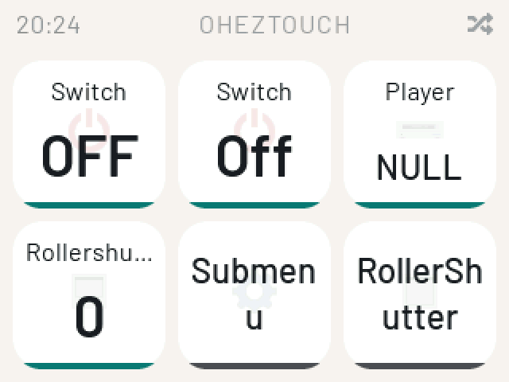
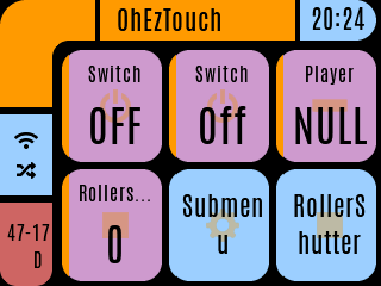
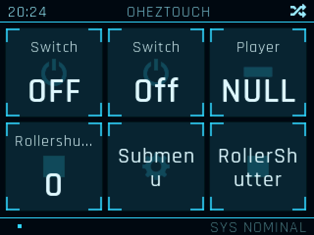
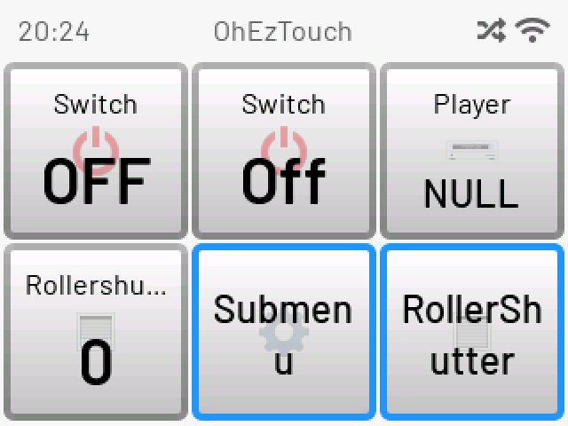
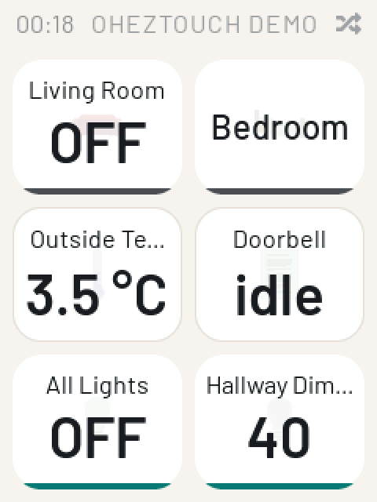
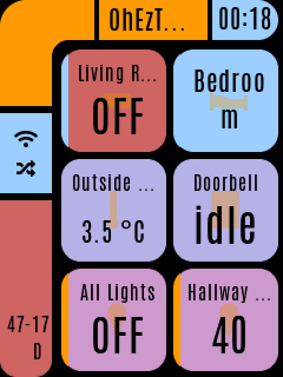
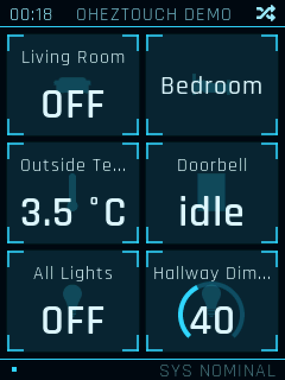
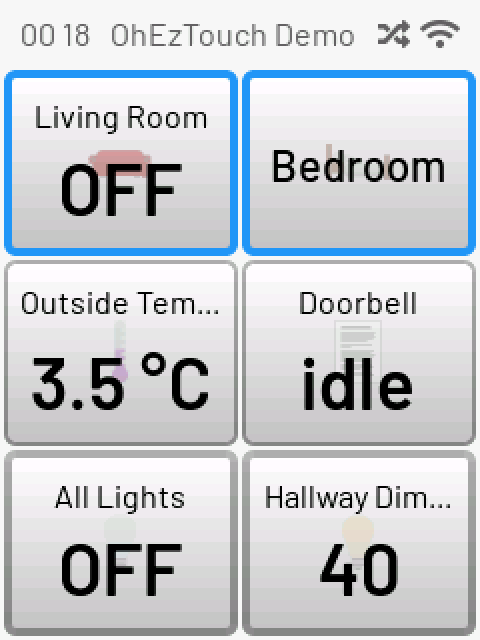

# OhEzTouch


OhEzTouch is an always-on touch control panel for home automation systems
driven by [openHAB](https://www.openhab.org/). The panel runs on an ESP32.
It builds its touch buttons and graphics dynamically from an openHAB sitemap
on the server.

## Features

- Dynamic user interface from an openHAB sitemap
- Four themes: Material, LCARS, JARVIS, Classic
- Landscape or portrait mounting, in every theme
- Web interface and REST API for configuration
- MQTT client: status, sensors, remote configuration, sounds
- Bluetooth LE beacon scanner (iBeacon, Eddystone)
- BME280 temperature, humidity and pressure sensor support
- Relay and LED outputs on supported boards
- Firmware updates over the air, single device or fleet
- Desktop simulator for development without hardware

## Themes

The main screen in each of the four themes:

| Material | LCARS |
| --- | --- |
|  |  |
| **JARVIS** | **Classic** |
|  |  |

Every theme also draws upright, for a panel mounted vertically
(`Orientation: portrait`, see [doc/configuration.md](doc/configuration.md)):

| Material | LCARS | JARVIS | Classic |
| --- | --- | --- | --- |
|  |  |  |  |

## Supported hardware

| Board | Document |
| --- | --- |
| ArduiTouch 2.4 inch | [doc/hardware/arduitouch.md](doc/hardware/arduitouch.md) |
| ArduiTouch 2.8 inch | [doc/hardware/arduitouch28.md](doc/hardware/arduitouch28.md) |
| Lanbon L8 | [doc/hardware/lanbon.md](doc/hardware/lanbon.md) |
| Cheap Yellow Display (ESP32-2432S028R) | [doc/hardware/cyd.md](doc/hardware/cyd.md) |

The user interface also runs on a Linux desktop. See
[doc/simulator.md](doc/simulator.md).

## Quick start

```bash
# 1. Install ESP-IDF v6.1
mkdir -p ~/esp
git -C ~/esp clone -b v6.1 --depth 1 --recursive https://github.com/espressif/esp-idf.git
~/esp/esp-idf/install.sh esp32
. ~/esp/esp-idf/export.sh

# 2. Get the code
git clone --recurse-submodules https://github.com/c5n/oh-ez-touch.git
cd oh-ez-touch

# 3. Build (example: ArduiTouch 2.4 inch)
idf.py -B build/arduitouch -DSDKCONFIG=build/arduitouch/sdkconfig \
       -DSDKCONFIG_DEFAULTS="sdkconfig.defaults;sdkconfig.defaults.esp32;sdkconfig.defaults.arduitouch" \
       set-target esp32
idf.py -B build/arduitouch build

# 4. Flash
idf.py -B build/arduitouch -p /dev/ttyUSB0 flash
```

For the details, see [doc/building.md](doc/building.md).

A new device opens an access point and shows its name and address on the
screen. Connect, enter your WLAN credentials, and select your openHAB server.
See [doc/configuration.md](doc/configuration.md).

## Documentation

| Document | Contents |
| --- | --- |
| [doc/building.md](doc/building.md) | Toolchain, build and flash instructions |
| [doc/configuration.md](doc/configuration.md) | WLAN setup, settings, web interface, REST API |
| [doc/sitemap.md](doc/sitemap.md) | Supported sitemap elements and examples |
| [doc/mqtt.md](doc/mqtt.md) | MQTT topics, remote configuration, sounds, relays and LEDs |
| [doc/ble.md](doc/ble.md) | Bluetooth LE beacon scanner |
| [doc/update.md](doc/update.md) | Over-the-air updates, fleet rollout, recovery firmware |
| [doc/simulator.md](doc/simulator.md) | The desktop simulator |
| [doc/devmgr.md](doc/devmgr.md) | The web-based fleet manager |
| [doc/architecture.md](doc/architecture.md) | System architecture and performance analysis |
| [doc/testing.md](doc/testing.md) | Unit tests and test fixtures |
| [doc/test-interface.md](doc/test-interface.md) | The simulator's script control interface |
| [doc/openhab-fixtures.md](doc/openhab-fixtures.md) | Test sitemaps for a real openHAB server |
| [doc/beeper.md](doc/beeper.md) | The sound engines and chime tables |
| [doc/fonts.md](doc/fonts.md) | UI fonts and how to regenerate them |
| [doc/icon-set.md](doc/icon-set.md) | The openHAB icon set |
| [doc/todo.md](doc/todo.md) | The ToDo list |

## Contributing

The project is still under development, but it is already very usable.

Comments, suggestions and code are welcome. The open tasks are in
[doc/todo.md](doc/todo.md).

Contact: c5n AT posteo DOT de

## License

[GNU General Public License v3.0](LICENSE.md)

## Credits

This project was created using these projects and libraries. Thank you to all
of them:

- [ESP-IDF](https://docs.espressif.com/projects/esp-idf/)
- [LVGL](https://lvgl.io/)
- [ArduinoJson](https://arduinojson.org/)
- [LodePNG](https://lodev.org/lodepng/)
- Embedded fonts: [Barlow, Rajdhani and Antonio](https://fonts.google.com/)
  (SIL OFL 1.1)

No longer used, but this project was built on them for a long time:

- [PlatformIO](https://platformio.org/)
- [AutoConnect](https://github.com/Hieromon/AutoConnect) (origin of the OTA
  update handler)
- [TFT_eSPI](https://github.com/Bodmer/TFT_eSPI)
- [Uptime Library](https://github.com/YiannisBourkelis/Uptime-Library)
- [Adafruit BME280 Library](https://github.com/adafruit/Adafruit_BME280_Library)
