# The openHAB demo

A ready-to-install openHAB configuration that shows everything the panel does
with a sitemap: every control and its screen, groups, Frames and the clock
frame, value labels, formatted values, colours, visibility rules, read-only
items, the Item PIN and the four themes.

```
doc/openHAB/
  items/ohezdemo.items          the items, every one named OHEZ_DEMO_...
  sitemaps/ohezdemo.sitemap     the sitemap "ohezdemo"
  transform/ohezdemo.map        the MAP the washing machine's status goes through
  seed-states.sh                gives every item a state
  make-screenshots.sh           takes the pictures below from the simulator
  img/                          the pictures
```

Every item carries the prefix `OHEZ_DEMO_`, so the demo can sit next to a real
configuration and be told apart from it.

The pictures were taken with the simulator against openHAB 5.2.1, in the
Material theme unless the section says otherwise.

## Installing it

Copy the three files into openHAB's configuration directory. openHAB loads
them within a few seconds. On a snap install:

```bash
OH=/var/snap/openhab/current/conf        # /etc/openhab on a package install
cp doc/openHAB/items/ohezdemo.items       $OH/items/
cp doc/openHAB/sitemaps/ohezdemo.sitemap  $OH/sitemaps/
cp doc/openHAB/transform/ohezdemo.map     $OH/transform/
```

The washing machine needs the **MAP Transformation** add-on (Settings →
Add-on Store → Other Add-ons). Without it, its tile shows the raw code
(`WASH`) and everything else works.

Then give the items states. An item openHAB has never been told about reads
`NULL`, and a demo full of `NULL` shows nothing:

```bash
doc/openHAB/seed-states.sh                       # or ... http://host:8080
```

The script only sets states, so the demo needs no bindings and no rules. Run it
again at any time to get back to the states the pictures show.

Point the panel at the sitemap: **Settings → openHAB → Sitemap** `ohezdemo`, in
the web interface, or on the simulator:

```bash
tools/ohez_ctl.py set oh_sitemap ohezdemo
```

To take the pictures again, for example after changing a theme:

```bash
doc/openHAB/make-screenshots.sh [http://host:8080] [build/linux/oh-ez-touch.elf]
```

It runs the simulator headless with a configuration of its own and writes
`img/*.png`. See [Testing](../testing.md) and
[The test interface](../test-interface.md).

To remove the demo, delete the three files from `$OH`.

## The home page and navigation


```
sitemap ohezdemo label="OhEzTouch Demo"
{
    Frame label="Clock" { ... }

    Frame label="Menu"
    {
        Text label="Basics" icon="settings" { ... }
        Text label="Media"  icon="blinds"   { ... }
        Group item=OHEZ_DEMO_gLights
        Text label="Values" icon="chart"    { ... }
        Text label="Rules"  icon="party"    { ... }
        Text label="Secure" icon="lock"     { ... }
    }
}
```

A page shows at most six tiles. A `Text` with a block of its own is a link to a
sub page: its tile shows the name over the icon and opens the page. A sub page
shows five tiles, because its first tile is the way back (the arrow in the
pictures below).

openHAB wants a page to be either all Frames or no Frames, so the six links
sit in a Frame called "Menu". The panel draws no headings: the items of every
Frame become tiles of the page, in order.

## The clock frame

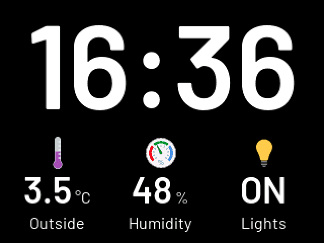

```
Frame label="Clock"
{
    Text   item=OHEZ_DEMO_Temp_Outside label="Outside"  icon="temperature"
    Text   item=OHEZ_DEMO_Humidity     label="Humidity" icon="humidity"
    Switch item=OHEZ_DEMO_gLights      label="Lights"   icon="light"
}
```

The Frame on the home page whose label matches the **Clock items frame**
setting (`Clock` by default) is not drawn as tiles. Its first three items are
shown under the time on the clock screen, which the panel shows when it dims
and **Show time and date when dimmed** is on. See
[The clock frame](../sitemap.md#the-clock-frame).

## Basics: the controls

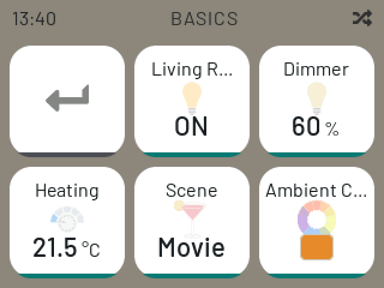

```
Text label="Basics" icon="settings"
{
    Switch      item=OHEZ_DEMO_Light_Living
    Slider      item=OHEZ_DEMO_Dimmer_Living
    Setpoint    item=OHEZ_DEMO_Heating_Set minValue=15 maxValue=26 step=0.5
    Selection   item=OHEZ_DEMO_Scene mappings=["MOVIE"="Movie", "DINNER"="Dinner", "READING"="Reading", "OFF"="Off"]
    Colorpicker item=OHEZ_DEMO_Color_Living
}
```

A **Switch** toggles on the tile itself. Every other control opens a screen of
its own, laid out for a finger. The back bar at the top closes it. A control
screen follows the server while it is open: a change made elsewhere shows at
once.

| Slider | Setpoint |
| --- | --- |
| 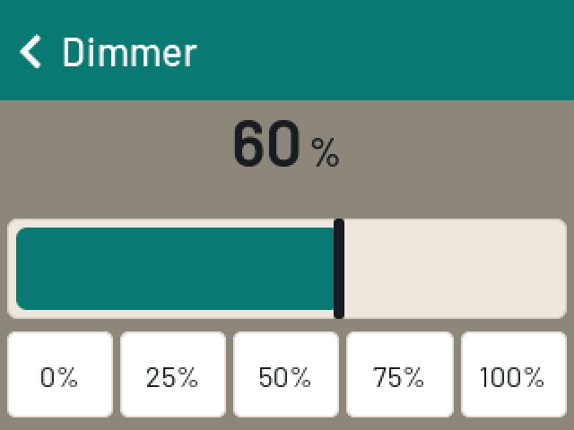 | 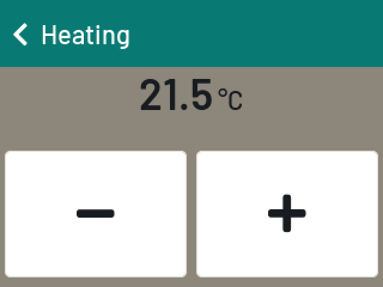 |
| Drag the bar, or tap one of the five steps. The value is sent when the finger lifts. | `−` and `+` move by `step`, within `minValue` and `maxValue`. |

| Selection | Colorpicker |
| --- | --- |
| 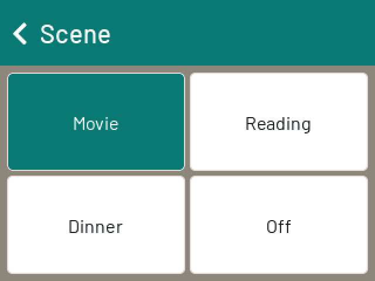 | 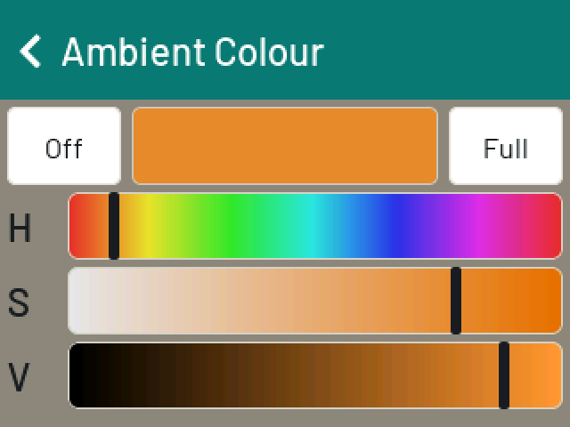 |
| One button per mapping. The current one is highlighted, and its label is what the tile shows. | Hue, saturation and value. Each bar shows the colours it reaches with the other two held. |

The tile shows the value with the unit a size smaller. The unit comes from the
state pattern, here `"Heating [%.1f °C]"` and `"Dimmer [%d %%]"`.

## Media: blinds and a player

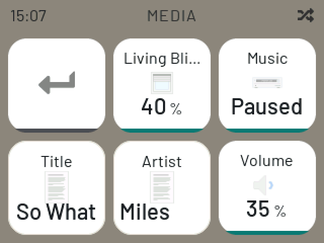

```
Text label="Media" icon="blinds"
{
    Frame label="Blinds"
    {
        Default item=OHEZ_DEMO_Shutter_Living
    }
    Frame label="Music"
    {
        Default item=OHEZ_DEMO_Player
        Text    item=OHEZ_DEMO_Title
        Text    item=OHEZ_DEMO_Artist
        Slider  item=OHEZ_DEMO_Volume
    }
}
```

| Rollershutter | Player |
| --- | --- |
| 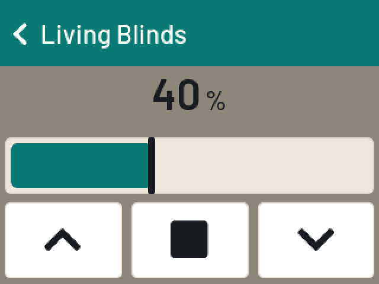 | 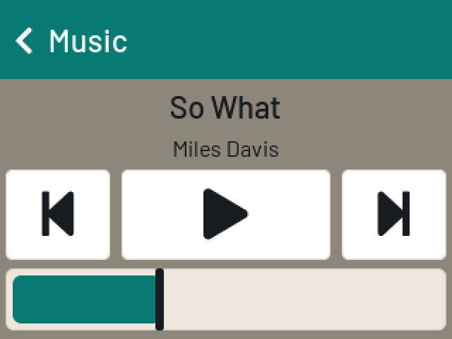 |
| `Default` on a Rollershutter item is a Switch widget. The screen shows the position and sends one from the field, or UP, STOP and DOWN. | `Default` on a Player item. Play/pause, previous and next, and what is playing. |

A Player item has no title. Bindings put it, the artist and the volume on items
of their own, and the player's screen takes them from its own Frame: the first
Text is the title, the next one goes on the line under it, and the Slider is
the volume. Change `OHEZ_DEMO_Title` over REST while the screen is open and the
new title shows at once. See [Players](../sitemap.md#players).

## Lights: a group

| Home page tile | The page openHAB generates |
| --- | --- |
|  | 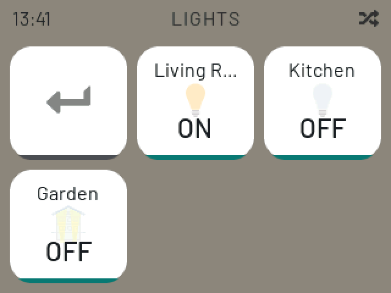 |

```
Group:Switch:OR(ON,OFF) OHEZ_DEMO_gLights "Lights" <light>
Switch OHEZ_DEMO_Light_Living  "Living Room" <light> (OHEZ_DEMO_gLights)
...
Group item=OHEZ_DEMO_gLights
```

A `Group` widget is both: its tile shows the group's aggregated state (`ON`
while any light is on) and a tap opens the member page openHAB builds by
itself, one Switch per member.

## Values: labels, formatted values, colours

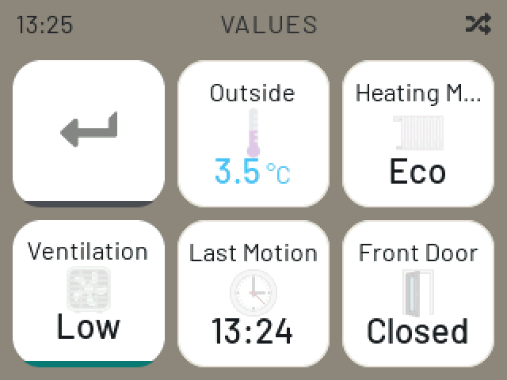

```
Frame label="Climate"
{
    Text      item=OHEZ_DEMO_Temp_Outside valuecolor=[<5="#4fc3f7", >25="orange"] iconcolor=[>25="red"]
    Text      item=OHEZ_DEMO_Mode
    Selection item=OHEZ_DEMO_Fan
}
Frame label="House"
{
    Text item=OHEZ_DEMO_LastMotion
    Text item=OHEZ_DEMO_Washer staticIcon=washingmachine
}
```

### Value labels

A tile shows the label openHAB gives a state where there is one. The labels
come from the first of these that has any:

1. the widget's `mappings=[...]` (Scene, Alarm, Presence)
2. the item's command options (Ventilation)
3. the item's state options (Heating Mode)

```
Number OHEZ_DEMO_Mode "Heating Mode" { stateDescription=""[options="1=Comfort,2=Eco,3=Away"] }
Number OHEZ_DEMO_Fan  "Ventilation"  { commandDescription=""[options="0=Off,1=Low,2=High"] }
Contact OHEZ_DEMO_FrontDoor "Front Door" { stateDescription=""[options="OPEN=Open,CLOSED=Closed"] }
```

**Heating Mode** holds `2` and reads "Eco". **Front Door** on the
[Secure](#secure-the-item-pin) page holds `CLOSED` and reads "Closed".
**Ventilation** is a Selection without mappings: its choices are the item's
command options.

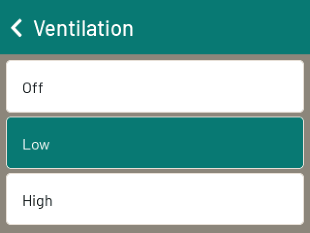

### Formatted values: MAP and patterns

```
String   OHEZ_DEMO_Washer     "Washer [MAP(ohezdemo.map):%s]" <washingmachine>
DateTime OHEZ_DEMO_LastMotion "Last Motion [%1$tH:%1$tM]"     <time>
```

```
# transform/ohezdemo.map
OFF=Off
WASH=Washing
RINSE=Rinsing
SPIN=Spinning
DONE=Finished
NULL=unknown
-=?
```

openHAB applies what is in the label's `[...]` and sends the result. The panel
shows that on a text tile:
- **Washer** holds `WASH` and reads "Washing", through the MAP.
- **Last Motion** holds an ISO timestamp and reads `13:40`, through the date
  pattern.

Both follow the state live: the sitemap events carry the newly formatted
value. A state options list does the same job without a transformation file.
The panel looks up those labels itself.

### Colours

| Outside below 5 °C, washer washing | Outside above 25 °C, washer done |
| --- | --- |
|  | 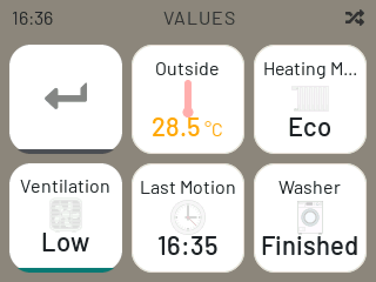 |

`valuecolor`, `labelcolor` and `iconcolor` are evaluated by openHAB and drawn by
the panel on top of the theme. The second picture was taken after only the
two item states were changed over REST. The panel follows the sitemap events:
it recolours the temperature and maps `DONE` to "Finished" without loading the
page again.

### Static icons

`staticIcon=washingmachine` in place of `icon=washingmachine` tells openHAB, and
the panel, that the icon does not depend on the state. The panel fetches it
once.

## Rules: visibility, colour rules, read-only items

| Show Details OFF | Show Details ON, Heating at 24 °C |
| --- | --- |
| 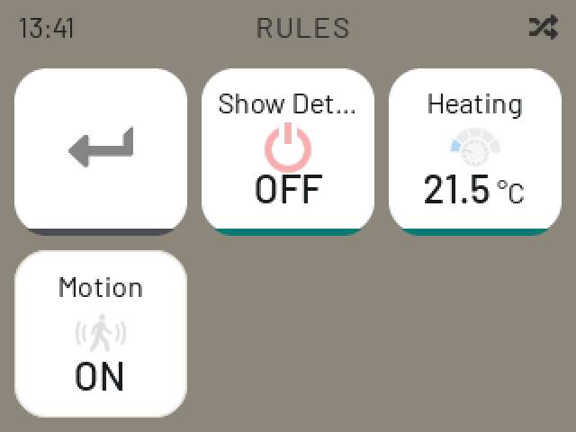 | 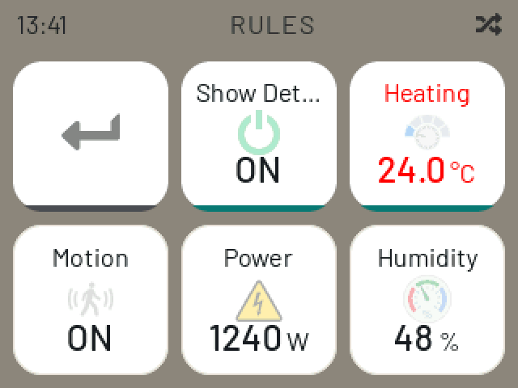 |

```
Text label="Rules" icon="party"
{
    Frame label="Always"
    {
        Switch   item=OHEZ_DEMO_ShowDetails
        Setpoint item=OHEZ_DEMO_Heating_Set minValue=15 maxValue=26 step=0.5 labelcolor=[>23="red"] valuecolor=[>23="red", <18="#4fc3f7"]
        Switch   item=OHEZ_DEMO_Motion
        Text     item=OHEZ_DEMO_Power visibility=[OHEZ_DEMO_ShowDetails==ON]
    }
    Frame label="Details" visibility=[OHEZ_DEMO_ShowDetails==ON]
    {
        Text item=OHEZ_DEMO_Humidity
    }
}
```

- **Visibility.** **Power** and the whole **Details** Frame are hidden while
  Show Details is OFF. A hidden widget takes no place: the tiles after it move
  up. Switching Show Details reloads the page on the panel by itself.
- **Colour rules.** At 24 °C both the label and the value of **Heating** turn
  red. Below 18 °C the value would be light blue.
- **Read-only.** **Motion** is a Switch widget over an item whose state
  description says `readOnly=true`. Its tile is drawn as a read-out, without
  the bar under it, and a tap does nothing.

```
Switch OHEZ_DEMO_Motion "Motion" <motion> { stateDescription=""[readOnly=true] }
```

## Secure: the Item PIN

| The page | A tap on Door Opener |
| --- | --- |
| 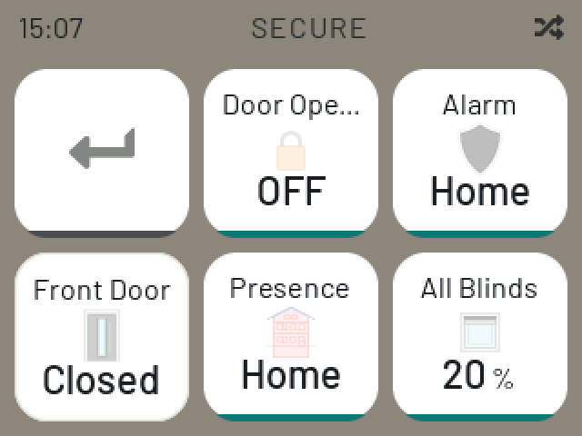 | 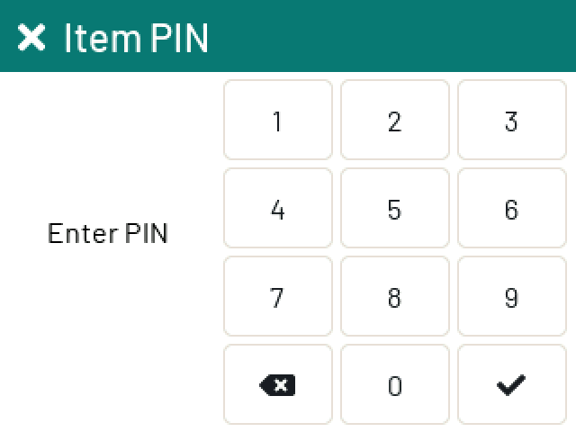 |

```
Text label="Secure" icon="lock"
{
    Switch item=OHEZ_DEMO_DoorOpener
    Switch item=OHEZ_DEMO_Alarm mappings=["DISARMED"="Disarmed", "HOME"="Home", "AWAY"="Away"]
    Text   item=OHEZ_DEMO_FrontDoor
    Switch item=OHEZ_DEMO_Away mappings=[OFF="Home", ON="Away"]
    Switch item=OHEZ_DEMO_gShutters
}
```

```
Switch OHEZ_DEMO_DoorOpener "Door Opener" <lock>   ["ohez-pin"]
String OHEZ_DEMO_Alarm      "Alarm"       <shield> ["ohez-pin"]
```

Items with the tag `ohez-pin` ask for the Item PIN before their tile does
anything, once an Item PIN is set under **Settings → System → Device → PINs**.
**Front Door** on the same page has no tag and is a read-out, so it never asks.
See [PINs](../configuration.md#pins).

The other tiles on the page:

- **Alarm** is a Switch with `mappings` over a String item. openHAB draws it
  as a row of buttons, and the panel opens the Selection screen for it.
- **Presence** is a Switch with `mappings` over a Switch item. It still
  toggles on the tile, and the tile shows the mapping's label ("Home")
  instead of the raw state (`OFF`).
- **All Blinds** is a Switch over `Group:Rollershutter:AVG`. The tile shows the
  average position, and the screen moves every member at once.

## Themes

The same home page in the four theme families, under **Settings → Theme**:

| Material | Classic |
| --- | --- |
| 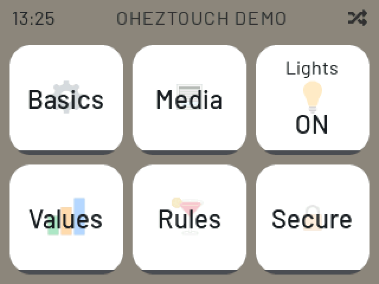 | 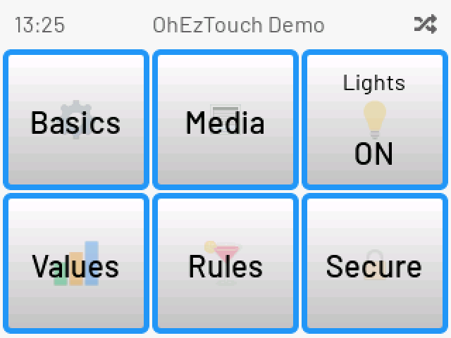 |

| LCARS | JARVIS |
| --- | --- |
| 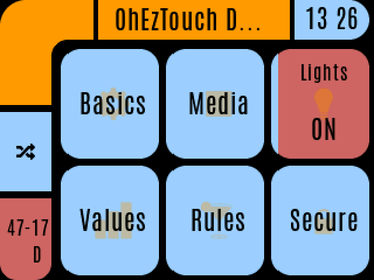 | 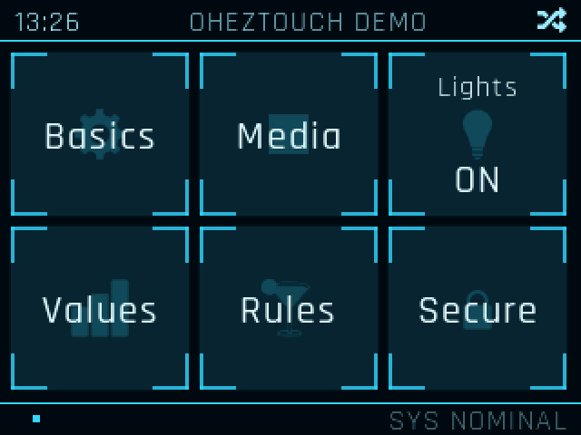 |

## What the demo does not show

- **Limits.** A page shows six tiles (five and the back tile on a sub page). A
  Selection offers ten entries, and a label holds 32 bytes. More is cut off
  without a message. `test/openhab/oheznav.sitemap` has pages that go past each
  limit.
- **Widgets the panel cannot draw.** Chart, Image, Video, Webview, Mapview,
  Input, and a Switch without mappings over a Dimmer or a Number, are left out
  and take no place.
- **Cover art.** A binding's album art is an Image item, and the panel draws
  no Image widgets.
- **Older servers.** Live colours and visibility need openHAB's sitemap events.
  On a server without them the panel follows item states only. See
  [Live updates](../sitemap.md#live-updates).
